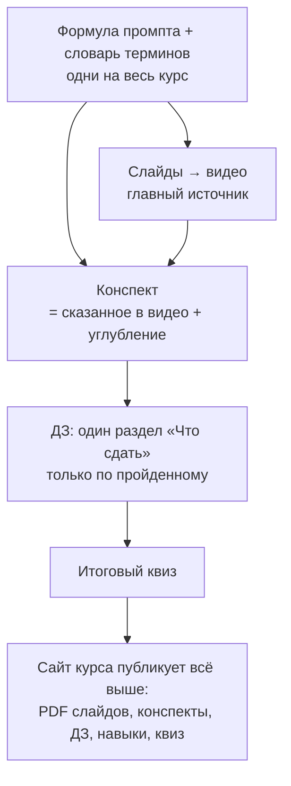

# Разбор: лекции 1–3 курса «ИИ в учебном процессе», версия 2026

> **Шаг 1 цикла SKICODING (текст).** Разбор написан **до правок**: ни один исходный файл
> в `docs/` не изменён. Дата: 2026-09-28.
>
> **Что разбиралось.** Три пары «презентация ↔ конспект с домашним заданием»:
> `*презентация*.pptx.txt` — текст слайдов, которые записываются на видео 2026 года;
> `Лекция N*.docx.md` — конспект с ДЗ потока 2025 года, заготовка домашней работы.
> Плюс исследование «Промпт-инжиниринг как семантическое управление гибридным ИИ —
> версия 2», программа повышения квалификации на 16 ч (**ориентир, не жёсткая рамка** —
> слова автора, 28.09.2026), ИИ-проект программы на 72 ч. Пять файлов ИИ-агентов и два
> учебных образца («FOREST — пенсионеры», «Луна») прочитаны целиком фоновым агентом;
> его цитаты выборочно сверены со строками файлов. Итог — §13.
>
> Адреса вида `Л2:769` — строка в тексте слайдов лекции 2; `ДЗ-2:536` — строка в конспекте
> лекции 2. Номера строк — по файлам в `docs/` на 28.09.2026.

## 1. Сводка

1. **Пары расходятся по-разному.** Лекция 1 — конспект шире слайдов, но с ними не спорит.
   Лекция 2 — треть тем слайдов в конспекте нет, зато в конспекте свои (15 фреймворков,
   Buyer Persona, «кейсы НГУ»). **Лекция 3 — две разные лекции под одним номером:** ядро
   конспекта (проверка работ, признаки ИИ-текста, этика, задания, устойчивые к ИИ)
   в слайдах отсутствует, ядро слайдов (агенты, настройка Perplexity, карта смыслов)
   в конспекте идёт хвостом.
2. **Несущий разрыв — непроверенные числа.** Курс учит фактчекингу, а сам в 13 местах
   приводит числа и «кейсы» без источника, включая «кейсы НГУ» с процентами. Материал
   выглядит исправным и молча ошибается — ровно определение несущего разрыва. Та же беда
   в агенте-детекторе из ДЗ-3: он выдаёт метрики, которые чат посчитать не может.
3. **Второй несущий — «что сдавать».** В каждом конспекте два-три списка заданий,
   слайд практики с ними не совпадает, правила сдачи в трёх лекциях разные.
4. **Хвосты 2025 года видны на камеру:** даты потоков, «Итого 20 часов» (в программе 16),
   13 строк от строительного курса («ПТО, прораб», «не только в строительстве»), имена
   моделей 2024–2025. Ещё две ссылки на строительные демо остаются намеренно — как
   примеры вайб-кодинга.
5. **Шести материалов**, на которые ссылаются слайды и ДЗ, в папке нет.
6. **Из исследования берём идею, а не числа:** двухслойный промпт (системный слой +
   задачный) — сквозная нить трёх лекций и мост к бонусному уроку про навыки. Числа
   исследования и часть ссылок не проходят проверку даже по виду.
7. **Порядок работ диктует запись:** слайды правятся первыми — на видео они замерзают;
   конспекты — следом, на сайте их можно менять всегда.

## 2. Схема: как должно быть после балансировки



## 3. Правило баланса (предлагается)

1. **Видео — главный источник.** Спорят слайд и конспект — правится конспект
   (или слайд, пока видео не записано).
2. **Конспект = всё, что сказано в видео, + углубление.** Углубление не противоречит
   видео и помечено «сверх лекции».
3. **ДЗ — один раздел «Что сдать»** в конце конспекта, только по пройденному; у каждого
   задания оценка времени; сумма по курсу сходится с часами программы (ориентир 16 ч).
4. **Одна формула промпта** — ROLE–GOAL–INPUT–FORMAT–STYLE–CONSTRAINTS–EXAMPLES–VERIFY —
   и один словарь терминов на все лекции.
5. **Любое число — с источником и датой.** Пример ответа ИИ — с пометкой «ответ ИИ,
   не проверен».
6. **Цены, тарифы, доступность сервисов** — с пометкой `[замер ДД.ММ.ГГГГ]`: к записи
   видео они устаревают первыми.

## 4. Таблица разрывов

Важность — по последствию: **несущий** (материал ложно выглядит верным), **важный**
(слушатель спотыкается и замечает), **терпит**. Фазы — в §5.

| № | Разрыв | Где | Важность | Фаза |
|---|---|---|---|---|
| Р1 | Числа и «кейсы» в авторском голосе без источника: LMArena «97 %», «94,1 % HumanEval», «1138 Search Arena»; «до 30 % студентов не осваивают»; НГУ «отсев ↓25 %, публикации ↑40 %», Финуниверситет, ВШЭ; «более 60 % студентов и преподавателей»; «97 % / 2 % / 1 % данных обучения»; «физико-технический факультет НГУ», ФЕН «+35 %, 60 %», ММФ; «Zhang et al., 2024 — 15–30 %», «Smith et al., 2024», «≈70 % (Kern & Hahn, 2018)»; «15–20 слов у ИИ»; «вероятность ИИ 85 %» | Л1:513–516, Л2:769, Л2:782–791, Л3:80, ДЗ-1:590–608, ДЗ-2:536, 623, 659–661, 684, 716, 726–740, ДЗ-3:101, 153 | **несущий** | B.1 |
| Р2 | Лекция 3: слайды и конспект — разные лекции (карта в §9) | Л3 целиком, ДЗ-3 целиком | **несущий** | C.3 |
| Р3 | Нет единого «что сдать»: ДЗ-1 — Часть 23 + ДЗ из 3 частей + «на неделю» + «на месяц»; ДЗ-2 — Часть 10 + ДЗ из 5 пунктов; ДЗ-3 — мини-практика + ДЗ из 10 пунктов. Правила сдачи разные: «вышлете все 3 по итогам» / «до 20 декабря 2025» / имя файла «ИИ-НГУ-Поток-2-…» | ДЗ-1:1570–1665, 1929–2017; ДЗ-2:842–1033; ДЗ-3:407–493 | **несущий** | A.3 |
| Р4 | Слайд практики ≠ ДЗ. Л1: на слайде нет суммаризации своего файла и частей 2–3. Л2: слайд — «3 версии материала», ДЗ — «2 уровня»; п. 1 ДЗ-2 повторяет тест из Л1; п. 4 — поиск источников в DeepSeek, хотя слайды для источников рекомендуют Perplexity | Л1:560–570 ↔ ДЗ-1:1929–1991; Л2:869–885 ↔ ДЗ-2:1011–1021 | важный | C.1, C.2 |
| Р5 | Названия занятий в пяти редакциях: Л1 «Создание и адаптация…», «Проверка работ студентов…»; Л2 «Нейрокопирайтинг и адаптация…», «ИИ-агенты, выявление ИИ контента и карта смыслов»; Л3 «…детекторы ИИ контента…»; ДЗ-3 «…проверка работ и выявление ИИ-контента»; программа — свои названия модулей | Л1:49–53, Л2:32–36, Л3:32–36, ДЗ-3:1 | важный | A.1 |
| Р6 | Даты 2025 и часы: «17/21/24 (28) ноября», «до 20 декабря 2025», «Итого 20 часов» при 16 ч в программе | Л1:49–65, Л2:32–48, Л3:32–49, ДЗ-2:1033 | важный | A.1 |
| Р7 | 15 строк строительного курса на слайдах: «ChatGPT Plus (агенты): удобно для постоянных ролей (ПТО, прораб)» ×5, «не только в строительстве» ×4, цель «глубокое понимание строительства… ваших проектов» ×4, демо pto-presentation и stroyka-alpha ×2 (эти две ссылки остаются по решению автора, Р15; хвостов — 13). Целого файла из строительного курса в папке нет (проверены все 17): строительное — только вставки в трёх презентациях; биография автора — не хвост. В том же блоке «Итог» неточность: «DeepSeek (цепочки): безопасно локально» — без интернета работает только открытая модель в LM Studio | Л1:23, 41, 386, 437, 446, 455, 479, 543, 558; Л2:23, 90; Л3:23, 132, 136, 331. Слайды: Л1 — 3–4, ≈49–58, 63–64; Л2 — 3, 9; Л3 — 3, 16–17, 44 | важный | C.1–C.3 |
| Р8 | Формула промпта в трёх редакциях: 8 элементов (слайды, ДЗ-1 Ч. 12, ДЗ-2 Ч. 2); 7 без «Стиля» (ДЗ-1 Ч. 19); 8 «правил» другого состава с «Ты должен…» и «примером плохого исполнения» | ДЗ-1:1258–1302; Л3:483–495 | важный | A.2 |
| Р9 | Главный инструмент: слайды — «перешёл полностью на Perplexity Pro», ДЗ-1 — «GigaChat… ваш главный инструмент в первую очередь». «Годовая подписка за 900 рублей» — без даты. Курс 2026 заявлен на бесплатных и доступных сервисах | Л1:32, 424; ДЗ-1:693, 1032, 1066 | важный | D.1 |
| Р10 | Нет в папке: «инструкция по фреймворкам мышления.pdf»; future-of-work.pdf; hai_ai_index_report_2025.pdf; «ИИ в вузах России: как преподавателям не отстать от зумеров»; файл «Стиль» (ссылка на Google Docs); Prompt_Constructor_Academic_Roles.xlsx (Google Sheets). Для бонуса «нейроиллюстрации» из плана курса материалов нет совсем | Л2:679; Л3:660; ДЗ-2:1027; ДЗ-3:489–491, 681 | важный | E.2 |
| Р11 | Этика — только в конспектах (ДЗ-1 Ч. 22, ДЗ-3 §3 и §8); в видео ни одного слайда. В программе этике отведён пункт 3.3 | ДЗ-1:1444–1568; ДЗ-3:163–251, 461–471 | важный | C.3 |
| Р12 | Детектор ИИ и «гуманизатор» в видео показаны без оговорки о пределах: детектор не доказательство, бывают ложные срабатывания. В конспекте оговорка есть («не доверяйте полностью»). Сам агент-детектор, которого ДЗ-3 велит поставить в пространство, «угадывает модель» по стилю и выдаёт метрику TTR, которую чат без запуска кода посчитать не может: отчёт выглядит строгим, а числа в нём выдуманы (§13) | Л3:301–315 ↔ ДЗ-3:449–451; детектор:145, 284–316, 386 | **несущий** | C.3, §13 |
| Р13 | Утверждения, устаревшие к 2026: «ИИ пока плохо справляется со связкой аудио → текст → видео», «ИИ плох в синтезе противоречивых позиций»; «продвинутые модели галлюцинируют чаще» как закон; модели GPT-4, ChatGPT-4o, Claude 3.5, «ChatGPT 5»; в программе «ChatGPT 4o mini» | ДЗ-3:227, 233; Л1:231; ДЗ-1:485; Л1:147, 181; Л2:803; программа:79, 131 | важный | D.1 |
| Р14 | Дубли между видео: 13 слайдов диалоговых промптов Л2 повторены в Л3 целиком; FOREST, универсальный промпт, вайб-кодинг, описание продукта и Buyer Persona — по два-три раза | Л2:532–633 ↔ Л3:146–247 | важный | C.3 |
| Р15 | Примеры вайб-кодинга в Л3 «для анкетирования» и «для зачётов» — страницы строительного курса: pto-presentation — «Профессия инженер ПТО: ключевая роль на стройке», stroyka-alpha — «Тестирование по ИИ для строителей» `[замер 2026-09-28]`. **Решение автора 28.09.2026: ссылки остаются** — это намеренные примеры того, что собирается вайб-кодингом (§10). Остаётся одна правка: подпись на слайде, чтобы преподаватель не принял пример из другой отрасли за ошибку. Страница со слайда 15 (ai-in-edtech) образовательная, но повторяет непроверенные примеры MIT, Stepik, Финляндии (Р1) | Л3:119–143 | терпит | C.3 |
| Р16 | Слабые источники под «кейсами»: otvet.mail.ru, studgen.ru, vc.ru «как увеличить объём текста в студенческой работе», infourok, disshelp — стоят сносками к числам, которых подтвердить не могут | ДЗ-2:1049–1131; ДЗ-3:511–553 | важный | B.1 |
| Р17 | Нумерация и опечатки на слайдах: в Л2 после «7. Работа с голосом» идёт «6. Адаптация»; в списке учёных пропущен № 9; слайд «Горизонтальная адаптация» повторяет принципы углубления (ООП, библиотеки), хотя ДЗ-2 §2.3 объясняет её верно; «Объём без: 100 %»; «процесссе», «Саморефлесирующий», «поторогать», «групповый» | Л2:236, 757, 845–866; Л3:260, 445, 525; Л3:102 | терпит | C.1–C.3 |
| Р18 | Два разных «конструктора промптов»: Vercel-страница (слайды Л2, инструкция в конце ДЗ-3) и таблица xlsx (ДЗ-2) | Л2:340–346; ДЗ-2:1025–1029; ДЗ-3:689–718 | терпит | A.2 |
| Р19 | Мусор экспорта Google Docs: 519 строк со сносками-якорями на чужие документы, `[^10]` в шаблонах, экранированные `\+`, `\-` | ДЗ-1, ДЗ-2, ДЗ-3 | терпит | E.1 |
| Р20 | Юмор с алкоголем в официальном видео НГУ: «Академик после 100 грамм виски», «Профессор после 50 грамм» (Л2), эссе «Академика» с «кабаком» (Л3) | Л2:190–193; Л3:640–656 | на усмотрение автора | — |
| Р21 | Курс не говорит, чем читать и править md-файлы навыков. Obsidian — удобный бесплатный редактор, но по умолчанию вставляет [[вики-ссылки]], которых не понимают агенты, и кладёт служебную папку `.obsidian` в папку, открытую как хранилище, — она уходит в архив навыка `[замер 2026-09-28]` | бонус, страница «Навыки», словарь, список инструментов | важный | F.1 |
| Р22 | Бонус не показывает агента на своём компьютере (VS Code): собрать навык из описания, собрать навык проверки ДЗ из инструкции преподавателя и прогнать его по папке обезличенных работ. Нужен свежий обзор агентов — бесплатных или работающих из России без VPN (GigaCode, Kimi K3 и другие) | бонус | важный | F.2 |
| Р23 | Сборщик сайта пропускает в архивы навыков скрытые папки (`.obsidian`) и `__MACOSX`; сторож их не ловит | `tools/sobrat-sajt.py`, `tools/proverit-sajt.py` | терпит | F.1 |
| Р24 | Противоречия, найденные при правке конспектов навыком: промпт «Живой научно-популярный текст» и слайд 32 Л2 требуют поддельной живости (группа З — то, что Л3 учит находить); «проект GigaChat» в шести местах не подтверждён справкой; «люди тоже угадывают плохо» опровергается Russell и др., 2025; «1,45 и 2,2 — одна фраза» вместо трёх пар | Л1, Л2, Л3, три навыка, конструктор | **несущий** | закрыт 28.09.2026 |

## 5. Фазы

| Фаза | Что закрывает | Результат |
|---|---|---|
| **A.1** | Р5, Р6 | единые названия занятий, часы по ориентиру программы, даты со слайдов убраны |
| **A.2** | Р8, Р18 | одна формула + слайд «два слоя» (§7); словарь терминов курса; один конструктор |
| **A.3** | Р3 | шаблон раздела «Что сдать» и одно правило сдачи для трёх лекций |
| **B.1** | Р1, Р16 | фактчек чисел и «кейсов» по навыку vault `adversarial-citation-factcheck`: по агенту на источник, скептический дефолт |
| **B.2** | §7 | фактчек исследования — до переноса любых его утверждений в лекции |
| **C.1** | Р4, Р7, Р17 по Л1 | список правок слайдов Л1 (слайд → было → стало), затем конспект Л1 2026 |
| **C.2** | Р4, Р7, Р17 по Л2 | то же для Л2 |
| **C.3** | Р2, Р11, Р12, Р14, Р15 | Л3 пересобирается после ответа на вопрос 1 (§11) |
| **D.1** | Р9, Р13 | замер сервисов 2026 с датой: бесплатные тарифы, доступность из РФ, цены, актуальные модели |
| **E.1** | Р19 | очистка конспектов от мусора экспорта — перед сайтом |
| **E.2** | Р10 | недостающие материалы: собрать, заменить или убрать ссылки |
| **F.1** | Р21, Р23 | бонус: раздел «Чем открыть и править навык» (Obsidian, две настройки ссылок, ловушка `.obsidian`); строки на странице «Навыки», в словаре и списке инструментов; сборщик и сторож не пускают скрытые папки в архивы |
| **F.2** | Р22 | бонус: раздел «Агент на своём компьютере» по свежему обзору агентов для VS Code; три промпта для агента; правила про персональные данные студентов |
| **G** | публикация | GitHub (ведёт автор) → Vercel: `vercel.json`, `.vercelignore`, `.gitignore`, `README.md`; проверка опубликованного сайта `tools/proverit-publikaciyu.py`; `noindex` у 404 |
| **H.1** | бонусный урок 2 | `content/bonus-illyustracii.md` из материалов `art-master/`: где рисовать бесплатно (Алиса AI, GigaChat), формула из 11 блоков, картинка к слайду, своё изображение по образцу, доработка, права; коллекция 11 стилей с промптами и 8 картинками |
| **H.2** | навык-иллюстратор | `skills/illustrating-lessons/` из инструкции агента ART PROMPT MASTER: 4 файла, описание 889 байт |
| **H.3** | навык НИР | `skills/niokr/` — копия навыка автора: без ссылок на навыки вне курса, примеры обезличены; до проверки сборка идёт с `PROPUSTIT_NAVYKI=niokr` |

Слайды (C.1–C.3) правятся списками правок: pptx в папке нет, правки вносит автор.
Конспекты 2026 пишутся **новыми файлами** рядом со старыми (приём «сохранить
и переписать»): файлы 2025 — архив потока, их не трогаем.

## 6. Метрика «до» `[замер 2026-09-28]`

Сквозная метрика балансировки — **число несущих разрывов** (сейчас 4: Р1–Р3, Р12). Остальное —
счётчики, которые обязаны уйти в ноль или в «объяснено».

| Метрика | До | Как получено |
|---|---|---|
| Строки строительного курса на слайдах | **15** (Л1 9, Л2 2, Л3 4); цель — **2**: две ссылки-примера остаются по решению автора (Р15) | команда 1 |
| Строки с датами и годом потока 2025 в шести файлах лекций | **25** (слайды 7 + 7 + 4, конспекты 1 + 4 + 2) | команда 2 |
| Строки со сносками-якорями экспорта в конспектах | **519** (312 + 147 + 60) | команда 3 |
| Материалы, на которые ссылаются, но их нет в папке | **6** | ручной список, Р10 |
| Места с числами и «кейсами» без источника в авторском тексте | **13** | ручной список, Р1 |
| Слайды, повторённые из лекции в лекцию целиком | **13** | сверка Л2:532–633 ↔ Л3:146–247 |

Команды запускаются из папки `docs/`:

```bash
# 1 — хвосты строительного курса
grep -c -E 'ПТО, прораб|не только в строительстве|понимание строительства|pto-presentation|stroyka-alpha' *презентация*.txt
# 2 — даты и год потока 2025
grep -c -E 'ноябр|декабр|2025' *презентация*.txt Лекция*.md
# 3 — сноски-якоря экспорта Google Docs
grep -c '#bookmark=' Лекция*.md
```

## 7. Что берём из исследования — и что нет

**Берём идеи.** Все — без чисел исследования.

| Идея | Куда в курсе |
|---|---|
| **Два слоя промпта.** Системный слой — роль, словарь дисциплины, правила, опора на файлы, критерии проверки и отказа; живёт в профиле, пространстве, проекте и меняется раз в семестр. Задачный слой — цель, аудитория, объём, формат, 1–2 примера, проверка именно этой задачи; 100–150 слов | **сквозная нить:** Л1 — какие из восьми элементов формулы уходят в системный слой; Л2 — все техники работают в задачном слое; Л3 — пространство = системный слой + база знаний; бонус — навык = переносимый системный слой с версией |
| **Четыре части системного слоя** языком преподавателя: словарь дисциплины (термины, связи, типичные ошибки студентов) · правила (уровень аудитории, точность, этика) · опора (файлы пространства) · проверка и отказ | Л3 (настройка пространства), бонус. Формальную запись (логика первого порядка, дескрипционные логики) отбрасываем — аудитории она не нужна |
| **Правило отказа:** разрешить модели ответить «не знаю», если в источниках нет | Л1 — практический вывод к слайду о наградах за «не знаю». Кандидат в ссылку — статья OpenAI «Why Language Models Hallucinate» (сентябрь 2025); проверить до вставки |
| **Ограничения, которые проверяются галкой** (идея Constraints-of-Thought): каждое ограничение пишется так, чтобы в VERIFY его можно было отметить | Л2, раздел «Ограничения как параметры качества» |
| **Пример с показанным ходом решения** (few-shot с рассуждением) | Л1 — EXAMPLES; Л2 — Chain-of-Thought |
| **Своя научная линия:** семантическое программирование (Ершов, Гончаров, Свириденко), онтологические модели (Пальчунов), фреймворк «Сигма» ЦИИ НГУ — гибридный ИИ как местная школа | Л1, слайд «Экспертные системы» — один абзац. Про «российскую стратегию гибридного ИИ» — только с источником |

**Не берём до фактчека (фаза B.2).** Все проценты: «87–89 %», «65 → 87 %», «70 → 100 %»,
«78 %», «45 / 62 / 89 %», «92 % точности диагностики»; таблицу «мировой ландшафт»
(в том числе «Stanford ALWAYS»); медицинский пример целиком — цена ошибки там не наша;
«∞ масштабируемость».

**Почему проверять обязательно — признаки видны без интернета:**

* год не сходится с номером arXiv, а номер кодирует год и месяц подачи: «Arguello et al.
  (2024)» — arXiv:2510.21425 (октябрь 2025); «(2021)» — arXiv:2407.08516 (июль 2024);
  «(2023)» — arXiv:2506.19773 (июнь 2025);
* «анализ 45+ источников» — в списке 22;
* в примере 12.2 «онтология Киевской Руси IX–XI веков» задана периодом [862, 1242],
  а 1242 год лежит вне IX–XI веков.

## 8. Программа на 16 ч как ориентир

| Модуль программы | Где в курсе 2026 | Расхождение |
|---|---|---|
| 1. Основы (4 ч): ландшафт, «под капотом», Perplexity, основы промптинга | Лекция 1 | совпадает; в программе Perplexity — отдельная тема 1.3 |
| 2. Создание и адаптация (4 ч): ChatGPT, DeepSeek, мультимодальность | Лекция 2 | программа идёт по сервисам, лекция — по техникам; «ChatGPT 4o mini» устарело |
| 3. Проверка, выявление ИИ-контента, этика (4 ч) | Лекция 3 — **только в конспекте** | в видео Л3 этого нет (Р2, Р11) |
| Итоговая аттестация (4 ч): тестирование, 10 вопросов, проходной балл 6 | итоговый квиз | формат квиза можно взять отсюда |
| — | агенты, карта смыслов, фреймворки, вайб-кодинг, LaTeX, навыки | в программе нет; для ориентира допустимо |

Литература программы проверена 28.09.2026 ([фактчек](FAKTCHEK-2026-09-28.md)): книги
«Atlas S. … Stanford University Press, 2023» и статьи «Васюков И.Л., Волобуев Н.А. // Высшее
образование в России. 2024. № 4» **не существует**; адреса cdto.hse.ru тоже нет. Реальные
замены — в файле фактчека: руководство Атласа 2023 года, статьи Кошкиной и др. (2025)
и Сысоева (2024) в том же журнале, Лаборатория цифровой трансформации образования ИО ВШЭ.

ИИ-проект программы на 72 ч — учебный материал для ДЗ-3 (п. 9: «сверьте с документами
Стэнфорда»), и ошибки в нём уместны — это и есть упражнение. Но к нему нужен ключ для
проверяющего. Два кандидата уже видны: «короткая продолжительность внимания (8 секунд)» —
известный миф; «86 % студентов и 61 % преподавателей» приписаны AI Index 2025 — проверить.

Ключ нужен и к двум другим образцам. Пункты ниже — из разбора фонового агента; при
составлении ключа перепроверить каждый:

* **«Луна»** — заголовок неверен по сути: первые снимки обратной стороны Луны сделала
  советская «Луна-3» в 1959 году, а у «Чанъэ-4» (2019) — первые снимки **с поверхности**
  обратной стороны. Следы гуманизатора: «Знаете, когда я впервые увидел…» (стр. 3),
  «И вот штука:» (стр. 15), английские подписи к картинкам; источник № 27 — сам системный
  промпт гуманизатора (стр. 105). «2 гигабита в секунду» (стр. 26) — проверить единицы;
* **«FOREST — пенсионеры»** — «54 % не используют интернет» (стр. 5) рядом с «самой
  активной аудиторией Госуслуг» (стр. 7); «каждый третий пенсионер старше 55» (стр. 29),
  хотя источник НАФИ — про каждого третьего россиянина; «старше 60 лет — 1,6 млрд»
  (стр. 120), а у ООН 1,6 млрд — это люди старше 65; из 57 источников в тексте упомянуты
  только 1–38.

## 9. Карта содержания по парам

✅ — есть и там, и там; 🎞 — только на слайдах; 📄 — только в конспекте; ⚠ — расходятся.

### Лекция 1 — «Введение в ИИ»

| Тема | Где | Что делать |
|---|---|---|
| Карточка докладчика, «моя цель» | 🎞 | цель сформулирована для строительного курса («ваших проектов») — переписать под преподавателей |
| План курса, даты, часы | 🎞 ⚠ | Р5, Р6 |
| Что такое ИИ, что умеет, IoT | ✅ / 🎞 | — |
| Иерархия ИИ, 8 уровней | ✅ | совпадает дословно |
| OCR, генеративный ИИ, список сервисов | ✅ | в ДЗ-1 список из 16 ссылок — проверить живость (coder.deepseek.com, labs.perplexity.ai) |
| Нейросети, трансформеры, ChatGPT | ✅ | — |
| Галлюцинации | ✅ ⚠ | «продвинутые чаще» — уточнить (Р13) |
| Как работает GPT, награды, токены, «русский дороже» | ✅ | — |
| Обучение: pre-train, fine-tuning, RLHF | ✅ ⚠ | в ДЗ-1 доли «97 / 2 / 1 %» без источника (Р1) |
| Контекстное окно; промпт, RAG, рассуждения, системный промпт | ✅ | сюда — слайд «два слоя» (§7) |
| Обзор помощников, режимы GigaChat, Perplexity, агенты, проекты, пространства | ✅ ⚠ | главный инструмент (Р9) |
| LMArena, LM Studio, фактчекинг | ✅ | — |
| Вайб-кодинг | ✅ ⚠ | «подходит: обучение» и «не подходит: образование» на одном слайде; для 2026 — мостик к агентной разработке и бонусу |
| Подбор инструментов по задаче | ✅ ⚠ | числа без источника (Р1) |
| Универсальный промпт, пример «Киевская Русь» | ✅ ⚠ | 7 элементов в ДЗ-1 Ч. 19 (Р8) |
| Практика | ⚠ | Р4 |
| Когда ИИ помогает, как формулировать, проверка ответа, ошибки, шаблоны (Ч. 18–25) | 📄 | углубление — оставить с пометкой «сверх лекции» |
| Этика (Ч. 22) | 📄 | Р11 |

### Лекция 2 — «Промпты и адаптация»

| Тема | Где | Что делать |
|---|---|---|
| Название: «Нейрокопирайтинг и адаптация» / «Создание и адаптация» | ⚠ | Р5 |
| Цели занятия | ⚠ | на слайде 8 техник, в конспекте 4 цели |
| Ролевые: писатели, профессии, учёные | 🎞 | в конспекте только имена; пропущен № 9 (Р17) |
| Нейрокопирайтинг, промпты «Лекция от Ньютона», «Семинар от Марии Кюри» | 🎞 | перенести в конспект |
| Таблица семи академических ролей | 🎞 | есть в «Промпты для Образовательной и Научной Деятельности в Вузах.md» — сослаться |
| Учебный план, пост, коммерческое предложение | ✅ | — |
| Конструктор промптов, влияние параметров | 🎞 ⚠ | Р18 |
| Ограничения как параметры, гуманизация и маркеры ИИ-текста | 🎞 | перенести в конспект; маркеры ИИ-текста связать с Л3 |
| Метод обратного промптинга | 🎞 | слайд — картинка, текста нет ни там, ни там |
| «Матрицы» — человечный текст; ректор и делегация из Китая | 🎞 | перенести в конспект или убрать |
| Последовательные промпты | ✅ | — |
| Диалоговые промпты (13 слайдов) | ✅ ⚠ | в конспекте абзац; в Л3 — повтор целиком (Р14) |
| Фреймворки FOREST, PESTLE, 7-S, SLAP, ODA, 6 шляп | ✅ | в конспекте ещё 15 фреймворков — пометить «сверх лекции» |
| Голос, видео, LaTeX, Overleaf | ✅ | — |
| Адаптация: проблема, три направления, кейсы | ✅ ⚠ | числа (Р1); «горизонтальная адаптация» на слайде неверна (Р17); кейсы НГУ в слайдах и конспекте — разные факультеты |
| Практика | ⚠ | Р4 |
| Описание продукта, Buyer Persona | 📄 | то же — на слайдах Л3; выбрать одно место |
| «Саморефлексирующий ИИ-агент» | 📄 | то же — на слайде Л3; выбрать одно место |

### Лекция 3 — «ИИ-агенты, выявление ИИ-контента, карта смыслов»

| Тема | Где | Что делать |
|---|---|---|
| Повторение: исследование по FOREST | 🎞 | это ответ ИИ с числами и «кейсами» (MIT, Stepik, Финляндия) — пометить «ответ ИИ, не проверен» |
| Вайб-кодинг, Vercel-страницы | 🎞 | Р15 |
| Фактчекинг: 13 слайдов диалоговых промптов | 🎞 | повтор Л2 — сжать до одного слайда-напоминания (Р14) |
| ИИ-агенты: копирайтер, исследователь, детектор, гуманизатор | 🎞 | промпт копирайтера — в конце ДЗ-3; пределы детектора (Р12) |
| Контекст = аудитория, продукт, Buyer Persona, словарь терминов | 🎞 | Buyer Persona — дубль ДЗ-2 |
| Настройка Perplexity: память, пространства, системные промпты, новости, задачи | 🎞 ⚠ | в ДЗ-3 другой пример (пространство «Этика ИИ») |
| «Правила универсального промпта» | 🎞 ⚠ | Р8 |
| Карта смыслов: 6 уровней, примеры, ИИ-лингвист, ИИ-смысловик, карта курса, текст по карте, эссе «Академика» | 🎞 | в ДЗ-3 только два системных промпта и п. 8 |
| Практика: отчёты Стэнфорда, своя программа | ✅ | файлов нет (Р10) |
| «Кто автор статьи — ИИ или человек?» (Луна) | ✅ | — |
| Проверка эссе и задачи по физике промптами | 📄 | ядро программы, модуль 3 — нужно в видео |
| Признаки ИИ-текста, три метода без детектора, «ИИ против ИИ», кейс эссе | 📄 | то же |
| Правила для студентов, четыре стратегии заданий, устойчивых к ИИ, градация по курсам | 📄 | то же; две стратегии устарели (Р13) |
| Шаблоны, мини-практика, частые ошибки, этика преподавателя | 📄 | Р3, Р11 |
| Инструкция к конструктору промптов | 📄 | относится к Л2 (Р18) |

## 10. Решения, принятые умолчанием

Скажите, если что-то не так, — правится одной строкой.

* **Источник истины — видео.** При расхождении конспект подстраивается под слайды.
* **Порядок:** слайды → конспекты → ДЗ; потом сайт, квиз, навыки.
* **Файлы 2025 не правим**, версии 2026 пишутся рядом.
* **Даты со слайдов убираем** (видео живёт дольше потока), расписание — на сайт;
  часы — по ориентиру программы, 16.
* **Формула — восемь элементов**, одна на все лекции; «правила универсального промпта»
  из Л3 становятся чек-листом к той же формуле.
* **Инструменты по умолчанию — бесплатные:** GigaChat, Алиса, DeepSeek, Perplexity
  (бесплатный тариф); ChatGPT — «если есть доступ». Всё — с датой замера.
* **Практика и зачёт:** см. решение автора 29.09.2026 ниже.

**Решения автора** (запись в день принятия):

* **28.09.2026 — программа на 16 ч — ориентир, а не жёсткая рамка.** Обстоятельство:
  программа формальная, содержание курса 2026 шире её модулей.
* **28.09.2026 — ссылки на pto-presentation и stroyka-alpha (Л3, слайды 16–17) остаются.**
  Обстоятельство: вайб-кодинг показывается как умение, а не как предметный материал —
  пример из другой отрасли это и доказывает. Правка: подпись на слайде, например
  «Пример из курса для строителей. Так же собирается анкета или мини-тест по вашей
  дисциплине».
* **29.09.2026 — домашних заданий нет.** После лекции — самостоятельная практика для себя,
  ничего не сдаётся, писем автору нет. Зачёт — итоговый тест: «сдано» от 44 из 72 (60 %,
  как 6 из 10 в программе); модуль и весь тест можно пройти заново, чтобы закрепить урок.
  Обстоятельство: практика нужна слушателю, а не для отчёта; знание материала проверяет
  тест. Раздел «6. Правила аттестации» программы на 16 ч переписан так же.
* **29.09.2026 — проект программы на 72 ч — образец того, что слушатель сможет составить
  сам; ориентир курса — программа на 16 ч.**
* **29.09.2026 — бонусный урок 2 про нейроиллюстрации** из материалов `art-master/`.
  Тексты всех 11 стилей сохранены, неоновый стиль — тоже. Картинки выбраны для
  преподавательской аудитории: 8 из 12, без пива, коктейлей и гротеска; в промптах стилей 6
  и 10 предмет заменён (пивная кружка → чай, бар → учебная тема), стиль не тронут. Параметры
  Midjourney и модели Perplexity из курса 2025 года сняты: урок строится на бесплатных
  Алисе AI и GigaChat. Обстоятельство: слушатели небогаты, видео — официальное видео НГУ (Р20).
* **29.09.2026 — навык `niokr` в курсе.** Примеры — документы автора, публикуются
  обезличенно; ссылки на авторов книг и статей остаются.

## 11. Открытые вопросы — закрыты 28.09.2026

Автор: «твои идеи приму как скажешь». Приняты рекомендации:

1. **Ядро лекции 3 — вариант (в):** проверка работ, выявление ИИ-контента, этика + коротко
   агенты-пространства. Карта смыслов переезжает в лекцию 2, к нейрокопирайтингу. Навыки —
   в бонусный урок.
2. **Числа:** утверждения автора — проверить и дать источник или убрать; примеры ответов ИИ —
   в упражнение «найди галлюцинацию» с ключом.
3. **Бонус 2026 — навыки.** «Нейроиллюстрации» из плана курса убираются: материалов нет,
   а упоминание без материалов оставляет слушателя с пустыми руками.

Там же автор поставил задачи: слайды переделывает сам по чек-листу правок; раздаточные
материалы с ДЗ и промптами, проект сайта без авторизации, пересборка детектора и гуманизатора
по современным навыкам Claude, правка трёх остальных навыков, проверка чисел и исправление
текста про Луну — за агентом. Требование к сайту: примеры текстов и промптов удобно
забирать, ссылки на нейросети открываются рядом, в новом окне, чтобы сайт оставался
у слушателя под рукой.

## 12. Чего не делаем сейчас

| Не делаем | Почему |
|---|---|
| Сайт на Vercel | тексты ещё не согласованы, PDF слайдов нет. На старте — discovery-интервью по канону vault и уроки Vercel: `cleanUrls` против SPA, сплошной rewrite как мягкий 404, утечка через `.vercelignore`, почта вместо формы |
| Итоговый квиз | ждём референс от автора. Ориентир программы — 10 вопросов, проходной 6 |
| Упаковку навыков | сначала решаем состав лекции 3 (вопрос 1). Образец упаковки — `~/NSU-AI-SKILLS`: один навык — один zip, `description` не длиннее 1024 байт, `soberi-zip.sh` |
| Перенос чисел из исследования | до фактчека (B.2) |
| Замер тарифов и доступности сервисов | отдельный шаг D.1 с датой — ближе к записи видео, иначе устареет |

## 13. Навыки из ИИ-агентов

Пять файлов агентов прочитаны целиком; размеры — `wc -c` по оригиналам, размеры
описаний — `printf '%s' "<описание>" | wc -c` `[замер 2026-09-28]`. Черновики описаний
лежат в отчёте агента и переносятся в SKILL.md при упаковке.

| Агент | Навык | Файлов | description | Очередь | Что поправить до упаковки |
|---|---|---|---|---|---|
| 6 шляп мышления | `six-thinking-hats` | 3 | 792 байта | первым | быстрый режим описан дважды по-разному (стр. 260–261 и 400–401); «ждать подтверждения» (стр. 281), а пример выдан одним ответом; бизнес-пример с «$50М» заменить вузовским; добавить запрет выдумывать данные |
| Копирайтер | `copywriter-styles` | 3 | 751 | вторым | реплика генератора «Я также добавил комментарий» (стр. 138); таблица стилей спорит со смесью 7 (стр. 127 ↔ 198); стили 4–8 описаны одной строкой; «LinkedIn, колонок на VC» заменить площадками вуза. Файл «Стиль» из ДЗ-3 уже внутри md (стр. 132–201) — ссылка на Google Docs не нужна |
| Исследователь | `research-assistant` | 5 — ровно одна загрузка | 836 | третьим | два разных первых ответа (стр. 102–112 и 806–843) и двойная концовка (стр. 849); счётчики «Найдено: X источников» (стр. 265) и «47 источников» (стр. 991) при запрете синтетики (стр. 58) — модель их выдумает; аудитория «ИТ-аналитики» (стр. 7) → преподаватели; «2015–2025» (стр. 951) |
| Детектор | `ai-text-detector` | 4 | 814 | после чистки | «Октябрь 2025», «GPT-4/4o» (стр. 5, 288); угадывание модели по стилю (стр. 284–316) убрать — почва для ложных обвинений; пороги TTR (стр. 145) и «уникальность 100 %» (стр. 532) — эвристика без источника, а TTR чат без кода не посчитает; признак «слишком высокий или слишком низкий TTR» (стр. 150–151) неопровержим; хвост генерации (стр. 643–693) убрать |
| Гуманизатор | **не упаковывать как есть** | — | — | — | цель «чтобы читатель никогда не заподозрил, что текст создан ИИ» (стр. 7) и совет «используй личный опыт: "сталкивался с этим"» (стр. 114): скачиваемый навык стал бы инструментом обхода проверки. Варианты: оставить материалом упражнения «редактор против детектора» в Л3 или переделать в `plain-style-editor` — живой язык без канцелярита, опыт не выдумывает, участие ИИ не скрывает (черновик описания — 729 байт) |

**Пределы Perplexity** — замер автора 19.09.2026 в `~/NSU-AI-SKILLS/README.md`: 100 файлов
на архив, до 5 навыков (архивов) за одну загрузку, `description` не длиннее 1024 байт. Все черновики укладываются
(729–836 байт). В YAML описание берётся в двойные кавычки: в тексте есть двоеточия. Упаковка —
по образцу `soberi-zip.sh`: один навык — один zip, без PDF.

**Двойное назначение.** Тело SKILL.md пишется так, чтобы целиком вставлялось инструкцией
пространства Perplexity или проекта GigaChat — для тех, у кого навыков нет или они только
на платном тарифе (тарифы — замер D.1).

**Сборник «Промпты для Образовательной и Научной Деятельности в Вузах».** 16 промптов;
в лекциях использованы два (Лектор-визионер → «Лекция от Ньютона», Практик-фасилитатор →
«Семинар от Марии Кюри») и таблица ролей. Семь академических ролей — готовая опора для
бонусного урока «навык по своей специальности». Попутные правки: иероглиф в слове
«Используй强ные» (стр. 560), ГОСТ 7.1-2003 → ГОСТ Р 7.0.100-2018 (стр. 631), приказ № 301 →
приказ № 245 от 06.04.2021 (стр. 634).

**Мост к лекции 3 (для C.3).** Гуманизатор и детектор — зеркальная пара: гуманизатор
снимает ровно то, что ищет детектор, — штампы, ровный ритм, безличность (категории 1, 3 и 4
детектора). Устоять могут только факты (категория 2) и сравнение с уровнем и прежними
работами автора (категория 5). Вывод для видео: стиль подделывается, проверку строить
на фактах, прежних работах и устных вопросах. Это и ответ на Р12.

## 14. Закрыто

Конспекты 2026 года (`content/`) закрывают разрывы на своей стороне; слайды автор правит
по [чек-листу](CHEKLIST-SLAJDOV.md) — там же каждый пункт для видео.

| Разрыв | Было | Стало | Чем подтверждается |
|---|---|---|---|
| Р1 (несущий) | 13 мест с непроверенными числами и «кейсами» | в конспектах — только числа с источником; непроверяемое убрано; ответы ИИ 2025 года стали упражнением «найди галлюцинацию» | [фактчек](FAKTCHEK-2026-09-28.md); `tools/proverit-sajt.py` — нет пометок «ПРОВЕРИТЬ» |
| Р2 (несущий) | лекция 3 — две разные лекции | решение (в); конспект Л3 собран заново: агенты, проверка работ, выявление, этика; карта смыслов — в Л2 | `content/lekciya-3.md`, `content/lekciya-2.md` |
| Р3 (несущий) | три списка заданий и три правила сдачи | в каждом конспекте один раздел «Самостоятельная практика», ничего не сдаётся; зачёт — итоговый тест, «сдано» от 44 из 72 (решение автора 29.09.2026) | `content/praktika.md`; сторож проверяет порог теста 44 и отсутствие адреса для писем |
| Р12 (несущий) | детектор с выдуманными метриками и угадыванием модели | навык `spotting-ai-writing`: без процентов и метрик, с беседой; пределы детекторов — в Л3 с источниками | `skills/spotting-ai-writing/`; сторож размера описаний |
| Р5, Р6 | пять редакций названий; даты 2025; «20 часов» | единые названия в конспектах; дат потоков и итоговых часов нет | конспекты; чек-лист слайдов |
| Р8 | три редакции формулы | одна формула из восьми элементов и два слоя | Л1 §5–6 |
| Р9, Р13 | Perplexity «за 900 ₽», старые модели, устаревшие утверждения | таблица сервисов с замером 28.09.2026; утверждения обновлены | Л1 §7; фактчек |
| Р10 | шесть отсутствующих материалов | отчёты Стэнфорда — ссылками; «Стиль» — внутри навыка `writing-in-styles`; таблица-конструктор заменена новым конструктором; «ИИ в вузах России…» — не нужен (п. 8 ДЗ-3 заменён картой смыслов в ДЗ-2). **Не закрыто:** «инструкция по фреймворкам мышления.pdf» — ждём от автора | конспекты |
| Р11 | этики нет в видео | этика — Л1 §10 и Л3 §4; для видео — слайды в чек-листе | Л1, Л3 |
| Р16 | слабые источники под «кейсами» | в конспектах только проверенные источники со ссылками в тексте | фактчек |
| Р18 | два конструктора | один конструктор на сайте, собран из двух авторских | `site/konstruktor/` |
| Р19 | 519 строк мусора экспорта | конспекты написаны заново в md | `grep -c '#bookmark=' content/*.md` → 0 |
| Р21 | курс молчит о том, чем читать md-файлы навыков | бонус §3 «Чем открыть и править навык» (Obsidian, две настройки ссылок, ловушка `.obsidian`); строки на странице «Навыки», в Л3 §1, словаре («Markdown»), списке инструментов | [фактчек](FAKTCHEK-2026-09-28.md): справка и русский перевод интерфейса Obsidian; замер архива 28.09.2026 |
| Р22 | нет агента на своём компьютере | бонус §6 «Агент на своём компьютере»: GigaCode, SourceCraft, Roo Code + LM Studio; две задачи, четыре правила, три промпта; пункт ДЗ по желанию | фактчек 29.09.2026: справки VS Code, GitVerse, SourceCraft, Kimi Code, Qwen Code, Roo Code |
| Р23 | служебные папки в архивах навыков | сборщик исключает скрытые файлы и папки, `__MACOSX`, `__pycache__`; сторож их ловит | `tools/proverit-sajt.py`: на опытном архиве поймал 8 служебных файлов из 10 |

**Метрика «после» `[замер 2026-09-28]`:** несущих разрывов в конспектах — 0 из 4; строк
строительного курса в конспектах — 0 (`grep -c -E 'ПТО, прораб|не только в строительстве' content/*.md`);
сносок-якорей экспорта — 0. Слайды — после правок автора по чек-листу.
