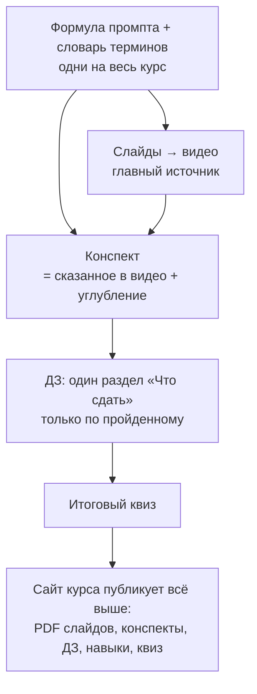

# Разбор: лекции 1–3 курса «ИИ в учебном процессе», версия 2026

> **Шаг 1 цикла SKICODING (текст).** Разбор написан **до правок**: ни один исходный файл
> в `docs/` не изменён. Дата: 2026-09-28.
>
> **Что разбиралось.** Три пары «презентация ↔ конспект с домашним заданием»:
> `*презентация*.pptx.txt` — текст слайдов, которые записываются на видео 2026 года;
> `Лекция N*.docx.md` — конспект с ДЗ потока 2025 года, заготовка домашней работы.
> Плюс исследование «Промпт-инжиниринг как семантическое управление гибридным ИИ —
> версия 2», программа повышения квалификации на 16 ч (**ориентир, не жёсткая рамка** —
> слова автора, 28.09.2026), ИИ-проект программы на 72 ч. Пять файлов ИИ-агентов и два
> учебных образца («FOREST — пенсионеры», «Луна») прочитаны целиком фоновым агентом;
> его цитаты выборочно сверены со строками файлов. Итог — §13.
>
> Адреса вида `Л2:769` — строка в тексте слайдов лекции 2; `ДЗ-2:536` — строка в конспекте
> лекции 2. Номера строк — по файлам в `docs/` на 28.09.2026.

## 1. Сводка

1. **Пары расходятся по-разному.** Лекция 1 — конспект шире слайдов, но с ними не спорит.
   Лекция 2 — треть тем слайдов в конспекте нет, зато в конспекте свои (15 фреймворков,
   Buyer Persona, «кейсы НГУ»). **Лекция 3 — две разные лекции под одним номером:** ядро
   конспекта (проверка работ, признаки ИИ-текста, этика, задания, устойчивые к ИИ)
   в слайдах отсутствует, ядро слайдов (агенты, настройка Perplexity, карта смыслов)
   в конспекте идёт хвостом.
2. **Несущий разрыв — непроверенные числа.** Курс учит фактчекингу, а сам в 13 местах
   приводит числа и «кейсы» без источника, включая «кейсы НГУ» с процентами. Материал
   выглядит исправным и молча ошибается — ровно определение несущего разрыва. Та же беда
   в агенте-детекторе из ДЗ-3: он выдаёт метрики, которые чат посчитать не может.
3. **Второй несущий — «что сдавать».** В каждом конспекте два-три списка заданий,
   слайд практики с ними не совпадает, правила сдачи в трёх лекциях разные.
4. **Хвосты 2025 года видны на камеру:** даты потоков, «Итого 20 часов» (в программе 16),
   13 строк от строительного курса («ПТО, прораб», «не только в строительстве»), имена
   моделей 2024–2025. Ещё две ссылки на строительные демо остаются намеренно — как
   примеры вайб-кодинга.
5. **Шести материалов**, на которые ссылаются слайды и ДЗ, в папке нет.
6. **Из исследования берём идею, а не числа:** двухслойный промпт (системный слой +
   задачный) — сквозная нить трёх лекций и мост к бонусному уроку про навыки. Числа
   исследования и часть ссылок не проходят проверку даже по виду.
7. **Порядок работ диктует запись:** слайды правятся первыми — на видео они замерзают;
   конспекты — следом, на сайте их можно менять всегда.

## 2. Схема: как должно быть после балансировки



## 3. Правило баланса (предлагается)

1. **Видео — главный источник.** Спорят слайд и конспект — правится конспект
   (или слайд, пока видео не записано).
2. **Конспект = всё, что сказано в видео, + углубление.** Углубление не противоречит
   видео и помечено «сверх лекции».
3. **ДЗ — один раздел «Что сдать»** в конце конспекта, только по пройденному; у каждого
   задания оценка времени; сумма по курсу сходится с часами программы (ориентир 16 ч).
4. **Одна формула промпта** — ROLE–GOAL–INPUT–FORMAT–STYLE–CONSTRAINTS–EXAMPLES–VERIFY —
   и один словарь терминов на все лекции.
5. **Любое число — с источником и датой.** Пример ответа ИИ — с пометкой «ответ ИИ,
   не проверен».
6. **Цены, тарифы, доступность сервисов** — с пометкой `[замер ДД.ММ.ГГГГ]`: к записи
   видео они устаревают первыми.

## 4. Таблица разрывов

Важность — по последствию: **несущий** (материал ложно выглядит верным), **важный**
(слушатель спотыкается и замечает), **терпит**. Фазы — в §5.

| № | Разрыв | Где | Важность | Фаза |
|---|---|---|---|---|
| Р1 | Числа и «кейсы» в авторском голосе без источника: LMArena «97 %», «94,1 % HumanEval», «1138 Search Arena»; «до 30 % студентов не осваивают»; НГУ «отсев ↓25 %, публикации ↑40 %», Финуниверситет, ВШЭ; «более 60 % студентов и преподавателей»; «97 % / 2 % / 1 % данных обучения»; «физико-технический факультет НГУ», ФЕН «+35 %, 60 %», ММФ; «Zhang et al., 2024 — 15–30 %», «Smith et al., 2024», «≈70 % (Kern & Hahn, 2018)»; «15–20 слов у ИИ»; «вероятность ИИ 85 %» | Л1:513–516, Л2:769, Л2:782–791, Л3:80, ДЗ-1:590–608, ДЗ-2:536, 623, 659–661, 684, 716, 726–740, ДЗ-3:101, 153 | **несущий** | B.1 |
| Р2 | Лекция 3: слайды и конспект — разные лекции (карта в §9) | Л3 целиком, ДЗ-3 целиком | **несущий** | C.3 |
| Р3 | Нет единого «что сдать»: ДЗ-1 — Часть 23 + ДЗ из 3 частей + «на неделю» + «на месяц»; ДЗ-2 — Часть 10 + ДЗ из 5 пунктов; ДЗ-3 — мини-практика + ДЗ из 10 пунктов. Правила сдачи разные: «вышлете все 3 по итогам» / «до 20 декабря 2025» / имя файла «ИИ-НГУ-Поток-2-…» | ДЗ-1:1570–1665, 1929–2017; ДЗ-2:842–1033; ДЗ-3:407–493 | **несущий** | A.3 |
| Р4 | Слайд практики ≠ ДЗ. Л1: на слайде нет суммаризации своего файла и частей 2–3. Л2: слайд — «3 версии материала», ДЗ — «2 уровня»; п. 1 ДЗ-2 повторяет тест из Л1; п. 4 — поиск источников в DeepSeek, хотя слайды для источников рекомендуют Perplexity | Л1:560–570 ↔ ДЗ-1:1929–1991; Л2:869–885 ↔ ДЗ-2:1011–1021 | важный | C.1, C.2 |
| Р5 | Названия занятий в пяти редакциях: Л1 «Создание и адаптация…», «Проверка работ студентов…»; Л2 «Нейрокопирайтинг и адаптация…», «ИИ-агенты, выявление ИИ контента и карта смыслов»; Л3 «…детекторы ИИ контента…»; ДЗ-3 «…проверка работ и выявление ИИ-контента»; программа — свои названия модулей | Л1:49–53, Л2:32–36, Л3:32–36, ДЗ-3:1 | важный | A.1 |
| Р6 | Даты 2025 и часы: «17/21/24 (28) ноября», «до 20 декабря 2025», «Итого 20 часов» при 16 ч в программе | Л1:49–65, Л2:32–48, Л3:32–49, ДЗ-2:1033 | важный | A.1 |
| Р7 | 15 строк строительного курса на слайдах: «ChatGPT Plus (агенты): удобно для постоянных ролей (ПТО, прораб)» ×5, «не только в строительстве» ×4, цель «глубокое понимание строительства… ваших проектов» ×4, демо pto-presentation и stroyka-alpha ×2 (эти две ссылки остаются по решению автора, Р15; хвостов — 13). Целого файла из строительного курса в папке нет (проверены все 17): строительное — только вставки в трёх презентациях; биография автора — не хвост. В том же блоке «Итог» неточность: «DeepSeek (цепочки): безопасно локально» — без интернета работает только открытая модель в LM Studio | Л1:23, 41, 386, 437, 446, 455, 479, 543, 558; Л2:23, 90; Л3:23, 132, 136, 331. Слайды: Л1 — 3–4, ≈49–58, 63–64; Л2 — 3, 9; Л3 — 3, 16–17, 44 | важный | C.1–C.3 |
| Р8 | Формула промпта в трёх редакциях: 8 элементов (слайды, ДЗ-1 Ч. 12, ДЗ-2 Ч. 2); 7 без «Стиля» (ДЗ-1 Ч. 19); 8 «правил» другого состава с «Ты должен…» и «примером плохого исполнения» | ДЗ-1:1258–1302; Л3:483–495 | важный | A.2 |
| Р9 | Главный инструмент: слайды — «перешёл полностью на Perplexity Pro», ДЗ-1 — «GigaChat… ваш главный инструмент в первую очередь». «Годовая подписка за 900 рублей» — без даты. Курс 2026 заявлен на бесплатных и доступных сервисах | Л1:32, 424; ДЗ-1:693, 1032, 1066 | важный | D.1 |
| Р10 | Нет в папке: «инструкция по фреймворкам мышления.pdf»; future-of-work.pdf; hai_ai_index_report_2025.pdf; «ИИ в вузах России: как преподавателям не отстать от зумеров»; файл «Стиль» (ссылка на Google Docs); Prompt_Constructor_Academic_Roles.xlsx (Google Sheets). Для бонуса «нейроиллюстрации» из плана курса материалов нет совсем | Л2:679; Л3:660; ДЗ-2:1027; ДЗ-3:489–491, 681 | важный | E.2 |
| Р11 | Этика — только в конспектах (ДЗ-1 Ч. 22, ДЗ-3 §3 и §8); в видео ни одного слайда. В программе этике отведён пункт 3.3 | ДЗ-1:1444–1568; ДЗ-3:163–251, 461–471 | важный | C.3 |
| Р12 | Детектор ИИ и «гуманизатор» в видео показаны без оговорки о пределах: детектор не доказательство, бывают ложные срабатывания. В конспекте оговорка есть («не доверяйте полностью»). Сам агент-детектор, которого ДЗ-3 велит поставить в пространство, «угадывает модель» по стилю и выдаёт метрику TTR, которую чат без запуска кода посчитать не может: отчёт выглядит строгим, а числа в нём выдуманы (§13) | Л3:301–315 ↔ ДЗ-3:449–451; детектор:145, 284–316, 386 | **несущий** | C.3, §13 |
| Р13 | Утверждения, устаревшие к 2026: «ИИ пока плохо справляется со связкой аудио → текст → видео», «ИИ плох в синтезе противоречивых позиций»; «продвинутые модели галлюцинируют чаще» как закон; модели GPT-4, ChatGPT-4o, Claude 3.5, «ChatGPT 5»; в программе «ChatGPT 4o mini» | ДЗ-3:227, 233; Л1:231; ДЗ-1:485; Л1:147, 181; Л2:803; программа:79, 131 | важный | D.1 |
| Р14 | Дубли между видео: 13 слайдов диалоговых промптов Л2 повторены в Л3 целиком; FOREST, универсальный промпт, вайб-кодинг, описание продукта и Buyer Persona — по два-три раза | Л2:532–633 ↔ Л3:146–247 | важный | C.3 |
| Р15 | Примеры вайб-кодинга в Л3 «для анкетирования» и «для зачётов» — страницы строительного курса: pto-presentation — «Профессия инженер ПТО: ключевая роль на стройке», stroyka-alpha — «Тестирование по ИИ для строителей» `[замер 2026-09-28]`. **Решение автора 28.09.2026: ссылки остаются** — это намеренные примеры того, что собирается вайб-кодингом (§10). Остаётся одна правка: подпись на слайде, чтобы преподаватель не принял пример из другой отрасли за ошибку. Страница со слайда 15 (ai-in-edtech) образовательная, но повторяет непроверенные примеры MIT, Stepik, Финляндии (Р1) | Л3:119–143 | терпит | C.3 |
| Р16 | Слабые источники под «кейсами»: otvet.mail.ru, studgen.ru, vc.ru «как увеличить объём текста в студенческой работе», infourok, disshelp — стоят сносками к числам, которых подтвердить не могут | ДЗ-2:1049–1131; ДЗ-3:511–553 | важный | B.1 |
| Р17 | Нумерация и опечатки на слайдах: в Л2 после «7. Работа с голосом» идёт «6. Адаптация»; в списке учёных пропущен № 9; слайд «Горизонтальная адаптация» повторяет принципы углубления (ООП, библиотеки), хотя ДЗ-2 §2.3 объясняет её верно; «Объём без: 100 %»; «процесссе», «Саморефлесирующий», «поторогать», «групповый» | Л2:236, 757, 845–866; Л3:260, 445, 525; Л3:102 | терпит | C.1–C.3 |
| Р18 | Два разных «конструктора промптов»: Vercel-страница (слайды Л2, инструкция в конце ДЗ-3) и таблица xlsx (ДЗ-2) | Л2:340–346; ДЗ-2:1025–1029; ДЗ-3:689–718 | терпит | A.2 |
| Р19 | Мусор экспорта Google Docs: 519 строк со сносками-якорями на чужие документы, `[^10]` в шаблонах, экранированные `\+`, `\-` | ДЗ-1, ДЗ-2, ДЗ-3 | терпит | E.1 |
| Р20 | Юмор с алкоголем в официальном видео НГУ: «Академик после 100 грамм виски», «Профессор после 50 грамм» (Л2), эссе «Академика» с «кабаком» (Л3) | Л2:190–193; Л3:640–656 | на усмотрение автора | — |
| Р21 | Курс не говорит, чем читать и править md-файлы навыков. Obsidian — удобный бесплатный редактор, но по умолчанию вставляет [[вики-ссылки]], которых не понимают агенты, и кладёт служебную папку `.obsidian` в папку, открытую как хранилище, — она уходит в архив навыка `[замер 2026-09-28]` | бонус, страница «Навыки», словарь, список инструментов | важный | F.1 |
| Р22 | Бонус не показывает агента на своём компьютере (VS Code): собрать навык из описания, собрать навык проверки ДЗ из инструкции преподавателя и прогнать его по папке обезличенных работ. Нужен свежий обзор агентов — бесплатных или работающих из России без VPN (GigaCode, Kimi K3 и другие) | бонус | важный | F.2 |
| Р23 | Сборщик сайта пропускает в архивы навыков скрытые папки (`.obsidian`) и `__MACOSX`; сторож их не ловит | `tools/sobrat-sajt.py`, `tools/proverit-sajt.py` | терпит | F.1 |
| Р24 | Противоречия, найденные при правке конспектов навыком: промпт «Живой научно-популярный текст» и слайд 32 Л2 требуют поддельной живости (группа З — то, что Л3 учит находить); «проект GigaChat» в шести местах не подтверждён справкой; «люди тоже угадывают плохо» опровергается Russell и др., 2025; «1,45 и 2,2 — одна фраза» вместо трёх пар | Л1, Л2, Л3, три навыка, конструктор | **несущий** | закрыт 28.09.2026 |

## 5. Фазы

| Фаза | Что закрывает | Результат |
|---|---|---|
| **A.1** | Р5, Р6 | единые названия занятий, часы по ориентиру программы, даты со слайдов убраны |
| **A.2** | Р8, Р18 | одна формула + слайд «два слоя» (§7); словарь терминов курса; один конструктор |
| **A.3** | Р3 | шаблон раздела «Что сдать» и одно правило сдачи для трёх лекций |
| **B.1** | Р1, Р16 | фактчек чисел и «кейсов» по навыку vault `adversarial-citation-factcheck`: по агенту на источник, скептический дефолт |
| **B.2** | §7 | фактчек исследования — до переноса любых его утверждений в лекции |
| **C.1** | Р4, Р7, Р17 по Л1 | список правок слайдов Л1 (слайд → было → стало), затем конспект Л1 2026 |
| **C.2** | Р4, Р7, Р17 по Л2 | то же для Л2 |
| **C.3** | Р2, Р11, Р12, Р14, Р15 | Л3 пересобирается после ответа на вопрос 1 (§11) |
| **D.1** | Р9, Р13 | замер сервисов 2026 с датой: бесплатные тарифы, доступность из РФ, цены, актуальные модели |
| **E.1** | Р19 | очистка конспектов от мусора экспорта — перед сайтом |
| **E.2** | Р10 | недостающие материалы: собрать, заменить или убрать ссылки |
| **F.1** | Р21, Р23 | бонус: раздел «Чем открыть и править навык» (Obsidian, две настройки ссылок, ловушка `.obsidian`); строки на странице «Навыки», в словаре и списке инструментов; сборщик и сторож не пускают скрытые папки в архивы |
| **F.2** | Р22 | бонус: раздел «Агент на своём компьютере» по свежему обзору агентов для VS Code; три промпта для агента; правила про персональные данные студентов |
| **G** | публикация | GitHub (ведёт автор) → Vercel: `vercel.json`, `.vercelignore`, `.gitignore`, `README.md`; проверка опубликованного сайта `tools/proverit-publikaciyu.py`; `noindex` у 404 |
| **H.1** | бонусный урок 2 | `content/bonus-illyustracii.md` из материалов `art-master/`: где рисовать бесплатно (Алиса AI, GigaChat), формула из 11 блоков, картинка к слайду, своё изображение по образцу, доработка, права; коллекция 11 стилей с промптами и 8 картинками |
| **H.2** | навык-иллюстратор | `skills/illustrating-lessons/` из инструкции агента ART PROMPT MASTER: 4 файла, описание 889 байт |
| **H.3** | навык НИР | `skills/niokr/` — копия навыка автора: без ссылок на навыки вне курса, примеры обезличены; проверено 29.09.2026: названные фамилии и контакты не находятся, 25 файлов, описание 916 байт |
| **H.4** | навык НИР: решения автора | п. 14 списка по тепловым сетям — соавтор-ректор не назван, вместо него «[и др.]»; строки «Методологическая опора» РАГРАФ — фамилии авторов источников возвращены; раздел 3.6 РАГРАФ — без ссылки на неопубликованное письмо и без фамилии; четыре пометки «фрагмент удалён» заменены пересказом без названий; суммы АРХИ 2026 не возвращаются |
| **H.5** | бонус 2 и главная | благодарность Дамиру Халилову в начале урока 2; фон главной — картинка автора (Qwen Chat, промпт стиля 1): справа растворяется в фоне страницы, на телефоне — баннер над текстом |
| **H.6** | практика: свой отчёт о НИР | раздел на странице «Практика»: навык `niokr` и промпт `pr-otchet-nir`; промпты простых страниц идут в библиотеку своим разделом — в библиотеке 57 промптов |
| **H.7** | «Назад к уроку» | уроки помечены `data-urok`; `sajt.js` ставит кнопку слева в шапке на страницах, открытых из урока, и возвращает на то же место; сквозная проверка в Chromium и WebKit — 32 из 32 |
| **H.8** | «О курсе» | фото главного корпуса НГУ вверху, логотип НГУ со строкой © внизу (в тёмной теме буквы светлые); раздел «Обратная связь» — почта автора с темой и заготовкой письма; ссылка на него из библиотеки промптов |
| **H.10** | меню на телефоне | на ширине ≤ 734 px ссылки шапки прятались без замены — оставалась одна «Нейросети ↗». Кнопка «Меню» по образцу глобальной навигации apple.com: панель на всю высоту под шапкой, крупные пункты разделов, ниже черты — ещё четыре страницы; закрывается кнопкой, Esc, выбором пункта, щелчком мимо и при расширении окна; под открытым меню страница не прокручивается. Навык `apple-design-web` дополнен рецептом и правилом «ссылки не прячутся без замены» |
| **H.11** | подвал — карта сайта | в меню телефона есть «Практика и зачёт», «Образцы», «Словарь», «О курсе», а на широком экране их нигде нет, кроме главной; подвал был в две строки. Подвал по рецепту «толстого подвала» навыка `apple-design-web`: четыре колонки (уроки, инструменты, практика и зачёт, о курсе) и строка о курсе; колонку уроков сборщик строит из списка уроков и сам подставляет подвал в рукописные страницы теста и конструктора. Попутно по снимку с iPhone: низ открытого меню не доходил до низа экрана под плавающей панелью Safari — панель тянется на `100lvh` |
| **H.12** | зачёт с ведомостью | автору нужна ведомость с адресами участников. Форму Google напрямую не заполнить — она открыта только после входа в Google, — поэтому сценарий Apps Script `tools/google-forma/Kod.gs`: собирается из вопросов сайта, заполняет форму (54 вопроса, 72 балла, сопоставления — по вопросу на пару), заводит таблицу с листами «Попытки» и «Ведомость» и триггер на каждый ответ. Проверен на макете Google: сборка, три попытки двух участников, пересборка, очистка. Автор запустил сценарий 29.09.2026, форма опубликована — forms.gle/Bk8ebKwGt6zH9FJh8; снаружи сверено: 54 вопроса и 180 вариантов совпадают с сайтом, почта собирается, ответы не видны. Открыто: пробная отправка и проверка ведомости; Google или Яндекс Формы (152-ФЗ, локализация); ссылка на форму с сайта |
| **H.9** | конструктор: какая вкладка видна | по умолчанию — «Системный слой»; пока читатель сам не выбрал вкладку, она следует за формой: без темы — системный, с темой — задачный, правка словаря — системный; без темы над вкладками — строка «нужна тема» с кнопкой «Вписать тему». Попутно найдено сквозной проверкой: абсолютный путь к `konstruktor.js` ломал открытие страницы с диска — возвращён относительный (адрес без слеша закрывает `trailingSlash`). Проверки: 162 из 162, Chromium, WebKit, с диска |
| **H.13** | вопросы зачёта для системы НГУ | автор переносит тест в систему НГУ вручную. `tools/vygruzit-test.js` собирает из тех же файлов вопросов `docs/TEST-ZACHET-VOPROSY-I-OTVETY.md` (30 вопросов, 72 балла) и `docs/TEST-PRODVINUTYJ-VOPROSY-I-OTVETY.md` (50, 120 — для проверки автором): варианты по порядку А–Г, ответ вида «(В)», у сопоставлений — пары целиком для ввода по парам, в конце ключ таблицей. На сайт не публикуется (`docs/` в `.vercelignore`); сторож сверяет, что выгрузка не отстала от вопросов (`--proverka`) |
| **H.14** | продвинутый тест, сайт без сбора результатов | `/test/prodvinutyj/` — самооценка: 10 модулей, по два на каждый из пяти уроков, 50 других вопросов (`content/test-prodvinutyj.js`), 120 баллов, «Продвинутый уровень» — от 72 (60 %). Движок общий, страница задаёт настройки в `window.TEST_NASTROJKI`, результаты — под своим ключом. На странице тренировочного теста — карточки «Зачёт» и «Продвинутый тест». Поля фамилии, имени и потока убраны с обеих страниц, прежняя подпись стирается из браузера, тексты — о тренировке. Проверки: сторож (оба набора, вопросы не повторяются, полей имени нет); сквозная — 34 из 34, Chromium и WebKit |
| **H.15** | фактчекинг в лекции 1 | раздел 8 «Проверка ответов и источников» ведёт к промпту «Фактчекер» (`l1-faktcheker`, по промпту Дамира Халилова — H.17) и к заданию 5 самостоятельной практики: три утверждения — из своей дисциплины, популярное в педагогике, из лекции; каждую ссылку открыть. В промпте две правки под раздел 4 «разрешите модели не знать»: вместо «объясняй на основе базы знаний» — «только источники из поиска, иначе так и скажи»; добавлен вердикт «недостаточно данных». Пример про вакцины заменён подстановкой `[УТВЕРЖДЕНИЕ]`. Время практики — около 3,5 часа; в библиотеке 58 промптов. Проверка: 28 из 28, Chromium и WebKit |
| **H.16** | благодарность Дамиру Халилову | ссылка — на бесплатный Telegram-канал «Промт дня» (`t.me/ai2smm`) вместо сайта. Сверено 30.09.2026: «Канал Дамира Халилова об ИИ для бизнеса и жизни». Адрес вида `t.me`, а не `web.telegram.org`: открывается и без входа в веб-версию Telegram |
| **H.17** | авторство промптов Дамира Халилова | со слов автора курса 30.09.2026: фактчекер, нейрокопирайтинг и промпты от имени учёных и писателей — материалы Дамира. Поле `avtor: halilov` в шапке промпта → подпись «По материалам Дамира Халилова — канал «Промт дня»» на карточке урока, в библиотеке и в `.docx`. Помечены шесть промптов: «Фактчекер» (Л1); «Лекция от Ньютона», «Семинар от Марии Кюри», «Блок проверяемых ограничений», «Живой научно-популярный текст», SLAP (Л2) — по слайдам 2025 года: роли 14–15, гуманизация 21–22, «фреймворки для нейрокопирайтинга» 33 и 49. В Л2 — по фразе в разделах «Ролевые промпты» и «Нейрокопирайтинг»; на «О курсе» — пункт в «Заимствованиях». Не помечены: семь академических ролей (слайд 13: «система ролей, которую мы с ИИ создали для вузов»), таблица профессий, FOREST, карта смыслов, навык `writing-in-styles`. Сторож: автор с карточки назван в «Заимствованиях»; проверка в браузере — 24 из 24 |
| **H.18** | курс НИУ ВШЭ в «Заимствованиях» | «Введение в промпт-инжиниринг» (Лекториум, lektorium.tv/prompt-en), авторы Д. В. Сошников и В. А. Булгаков; выпуск 2024 года — со слов автора курса, на странице курса год не указан (сверено 30.09.2026). Какие именно материалы взяты — не выяснено, поэтому пометок у отдельных промптов нет |
| **H.20** | скорость переходов | автор: на телефоне каждая страница «ползёт». Внешних ресурсов нет (шрифты системные, чужих скриптов нет), страницы лёгкие. Причина — кэш Vercel по умолчанию `max-age=0, must-revalidate`: каждый переход — страница и три «304» за `sajt.css`, `sajt.js`, `servisy.js`, и проверка стилей держит отрисовку. Сборщик ставит отпечатки `?v=`, `vercel.json` — кэш на год (как в FIVELETTERS). Замер Chromium, 1,6 Мбит/с: при задержке 400 мс — 0,87 → 0,45 с, при 1 с — 2,06 → 1,05 с на переход. Сторож сверяет отпечатки с файлами — правка `sajt.css` без пересборки даёт 16 расхождений |
| **H.21** | PWA: курс на устройстве и без связи | `manifest.webmanifest`, иконки 180/192/512/маскируемая, `sw.js` из `tools/shablon-sw.js`. Сохраняется всё своё, кроме видео: 59 адресов, 4,1 МБ. Проверка `proverka-pwa.js`, 25 из 25: после одного визита без сети — 15 страниц со стилями и картинками, оба теста, конструктор, файлы; «Нет связи» на несохранённом; при задержке 1 с переход — 15–30 мс; новая версия переносит неизменившиеся файлы без сети. Прежние сквозные проверки с worker — без провалов (34, 102, 32, 162, 28, 24). Идея «поставил на ноутбук — VPN не нужен» верна для материалов курса после первого открытия; нейросети, форма зачёта и обновления — только при связи |
| **H.22** | как поставить курс | «О курсе» → «Курс на телефоне и ноутбуке» и ссылка в подвале: iPhone — как в FIVELETTERS; Android — Chrome, Яндекс Браузер; компьютер — Chrome, Яндекс Браузер, Edge, Safari на Mac — пути меню по справкам Google, Яндекса, Microsoft, Apple (30.09.2026). О VPN на сайте не пишем — с 1 марта 2024 года запрещено распространять сведения о способах обхода блокировок (406-ФЗ) |
| **H.23** | видео и слайды — по запросу | решение автора: заготовка «Видео лекции появится здесь…» и строка «PDF появится после записи видео» убраны, поле `slajdy:` лекций очищено; под конспектом — «Видео лекции и слайды — по запросу: напишите автору»; шаг 1 на главной — «Читайте лекцию»; на «О курсе» — строка про запрос. Встраивание видео в сборщике оставлено |
| **H.24** | самодиагностика в конце лекции 1 | промпт автора «Самодиагностика: профиль преподавателя по четырём ролям» (`l1-samodiagnostika-paei`) — модель PAEI Адизеса, переложенная на роли эксперта-практика, методиста-организатора, инноватора-проектировщика и педагога-наставника: 12 вопросов, шкала 0–3, обратные вопросы, уточнения при равенстве, отчёт с картой компетенций, рисками, двумя запросами к ИИ и планом на две недели. Раздел «Самодиагностика: ваш профиль преподавателя» — после «Проверьте себя»; пункт в «Что вы унесёте»; источник — Adizes, The Ideal Executive, 2004. Текст промпта не менялся по смыслу: `[…]` шаблона отчёта → `{…}` (сайт подсвечивает `[…]` как места для читателя), “…” → „…“. Промпт в 254 строки свёрнут на странице: длиннее 60 строк — «Показать весь промпт — N строк», копирование берёт весь текст. Проверка `proverka-paei.js`: 32 из 32, Chromium и WebKit |
| **H.25** | организация — НГУ | решение автора 03.10.2026: слушателям важен бренд университета, не подразделение. «Новосибирский государственный университет» (коротко — НГУ) — в шапке главной, в описаниях страниц, в подвале, в manifest, в рекламной карточке и письме. ЦИИ НГУ остался там, где речь об авторе («ведущий специалист Центра искусственного интеллекта НГУ», строка ©) и об исследованиях ЦИИ в лекции 1 |
| **H.26** | зачёт — на сайте НГУ; тесты — для самопроверки | решение автора 03.10.2026: на сайте НГУ — видео лекций и итоговый тест из 10 вопросов; ссылка на форму Google путала бы слушателей. Убраны: кнопки и строки «Сдать зачёт в ведомость» на страницах тестов, в пяти уроках, на «Практике», «О курсе», на главной, в подвале; константа `FORMA_ZACHETA` и подстановка `{{forma_zacheta}}`; кнопка формы в итоге теста. Тесты: «Тест среднего уровня» (`/test/`, итог «Средний уровень пройден»), «Тест повышенной сложности» (`/test/prodvinutyj/`, «Повышенная сложность пройдена»); адреса прежние. В меню — «Тесты», подпись «Практика и самопроверка». На страницах тестов и в подвале — ссылка на самодиагностику по Адизесу. Строка о видео на уроках: «Видео лекций — на сайте НГУ, где сдаётся зачёт. Слайды — по запросу». Сторож требует, чтобы на сайте не было `forms.gle`, `docs.google.com/forms` и слова «ведомость»; сверка `Kod.gs` снята. Проверки: тесты 34/34, меню 102/102 (с новыми подписями), PWA 25/25, самодиагностика 32/32 |
| **H.27** | ссылка на GitHub автора | в нижней строке подвала всех страниц: «разработка сайта и курса — github.com/Barbashin1970» |
| **H.28** | QR-код адреса сайта | в подвале главной — для показа в видео: `site/assets/qr-sajt.svg` (уровень коррекции Q, тёмное на белом и в тёмной теме) из `ADRES_SAJTA`, `tools/sobrat-qr.py` (библиотека `qrcode`). Распознан `zxing-cpp` со снимков страницы в Chromium и WebKit, в светлой и тёмной теме, в натуральную величину и уменьшенным до 100 px — во всех восьми случаях ровно адрес сайта. Сторож сверяет адрес в коде с `ADRES_SAJTA`. Тот же файл — для последнего слайда |
| **H.29** | непубличный образец НИР снят из навыка `niokr` | 06.10.2026, решение автора. Отчёт о НИР и ТЗ на НИР по беспилотнику раскрывали не только тему, но и метод (связка Orange Pi RK3588 и Betaflight, синхронизация UART, планирование по временным окнам, числа замеров) и исполнителя («Директор ЦИИНГУ»): переименование темы этого бы не скрыло. Оба файла перенесены в `vhod/niokr-ne-publikovat/` (на сайт и в архивы не попадает), ссылки поправлены: README образцов, справочник про стенд, SKILL.md, «Практика», таблица навыков бонуса 1 — образцов теперь 16 из четырёх областей. Новый `niokr.zip`: 23 файла, слов о беспилотнике — 0. Опубликованы файлы были с 29.09.2026 в архиве на сайте и в публичном репозитории `NSU-AI-SKILLS` (там же история коммитов `7cc07c6`, `0e144ed`); пакет автор чистит сам по подготовленным командам |
| **H.30** | репозиторий публичный, дубль на GitHub Pages | 06.10.2026 автор открыл репозиторий как образец для преподавателей. Найдено при открытии: в репозитории и по прямой ссылке доступны `vhod/niokr-ne-publikovat/` (отчёт и ТЗ по беспилотнику, коммит `656dbec`) и ключ ответов `docs/TEST-ZACHET-…`; в истории — те же образцы в `skills/niokr/primery/` (`d399fb7`, `b606be4`). `vhod/` — в `.gitignore` и снят с учёта (`git rm --cached`, локальные 19 файлов на месте); историю автор чистит `git filter-repo` по подготовленным командам. Дубль: `tools/dlya-pages.py` + `.github/workflows/pages.yml`, проверка копии в подпапке — 49/49; на живом `barbashin1970.github.io/PROMPT-Professor/` — тоже 49/49 (после замены `deploy-pages@v4` на v5). Автор удалил `vhod/` с диска; скрипт правок пакета навыков — `~/pravki-nsu-ai-skills.py`. На 06.10 старые коммиты с образцами ещё открыты — чистка истории не выполнена |
| **H.31** | два адреса сайта | решение автора 06.10.2026: основной — GitHub Pages, второй — Vercel, на сайте рядом. `ADRES_SAJTA` = GitHub (QR, ссылки `.docx`, выгрузка вопросов), `ADRES_VTOROJ` = Vercel; подстановки `{{adres_osnovnoj}}`, `{{adres_vtoroj}}` для «О курсе». Подвал главной — два QR-кода по краям, подпись между ними (и на телефоне — чтобы коды не стояли рядом); распознаны оба в Chromium и WebKit, в светлой и тёмной теме, при 100 px — ровно свои адреса; между карточками на ноутбуке 559 px. Сторож сверяет оба кода с константами |
| **H.32** | карта смыслов — в лекцию 3, агент-смысловик | 10.10.2026, просьба автора по слайдам «Лекция 3 — 2026» (25–43) и тексту записанной лекции 2 («Лекция 2 … 2026 год», 75 слайдов). Разрывы: (1) в записи лекции 2 карты смыслов нет — она только в плане курса как тема лекции 3, а на сайте карта, четыре её промпта (`l2-smyslovik`, `l2-lingvist`, `l2-portret-auditorii`, `l2-tekst-po-karte`), задание 3 практики и вопрос «Проверьте себя» стоят в лекции 2; решение от 28.09.2026 «карта — в лекцию 2» отменяется; (2) карта на сайте только **извлекается из готового текста**; агента, который **опрашивает** преподавателя и сводит ответы с его старыми материалами, нет, как нет и продолжения «карта → новый курс и тест»; пример карты автора (слайды 39–40) на сайт не попал; (3) модуль 4 обоих тестов — «…и карта смыслов», ссылка «Повторить» ведёт в лекцию 2. План: раздел 5 лекции 3 «Карта смыслов и агент-смысловик» — шесть уровней, карта из текста, контекст = аудитория (слайд 24), агент-смысловик, пример карты курса; промпты лекции 2 переезжают с новыми `id` `l3-…`, новые — интервью и карта, системный слой смысловика, курс по карте, тест по карте; в практике лекции 3 — два задания, в лекции 2 задание 3 снимается; в лекции 2 шаг «портрет аудитории» ссылается на промпт в лекции 3; тесты (автор: «вопросы меняй как угодно — шесть модулей условно»): вопрос об уровнях карты из модуля 4 среднего теста — в модуль 6, взамен в модуле 4 — «ошибка адаптации ↔ пример»; в продвинутом — новый вопрос модуля 4 «просьба коллеги ↔ направление адаптации», в модуле 5 — «ответ смысловику ↔ уровень карты»; навык `mapping-course-meanings`. (4) Автор: «карту смыслов доработай с сегодняшнего взгляда — современнее и точнее для преподавателей». Карта 2025 года пришла из копирайтинга: вопросы уровней общие («что даёт материал»), ИИ в ней нет, связи с проектированием курса нет. Доработка: вопросы уровней — в терминах преподавателя (рациональный — проверяемые действия, что сам, а что с ИИ; студенческий — с чем приходят, где ошибаются, что даётся трудно; контекстный — что изменил ИИ в дисциплине); столбец «что даёт курсу»; карта ложится на обратное проектирование (Wiggins, McTighe, 2005, ISBN 978-1-4166-0035-0, сверено 10.10.2026): результаты → проверка → занятия; критерии хорошей карты; пример карты курса — с позиции 2026 года; промпты смысловика, интервью, курса и теста по карте — по новым определениям; вопрос среднего теста об уровнях — по новой таблице. Чего не делаем: не сверяем всю лекцию 2 с записью (промпты совпадают, кроме карты), не меняем число модулей и баллы тестов, не добавляем седьмой уровень — ИИ входит в три существующих. **Сделано 10.10.2026.** Лекция 3, раздел 5 `#karta-smyslov`: контекст = аудитория, шесть уровней в три столбца, обратное проектирование, какой должна быть карта, карта из текста, агент-смысловик, пример карты курса 2026 года; промптов в лекции 3 — 18 (4 из лекции 2 с новыми `id` и 4 новых), в лекции 2 — 13, на сайте — 63; практика лекции 3 — около 8 ч, 7 заданий, лекции 2 — около 4 ч; навык `mapping-course-meanings` (SKILL.md и пять справочников), навыков — 8; тесты: модули и выгрузки для НГУ пересобраны, `Kod.gs` тоже; в словаре — «Агент-смысловик». Задание про Луну уже в лекции 3 (раздел 7, задание 2 практики) — переносить нечего. Проверки: сборка — 0 замечаний; сторож — 16 страниц, 8 архивов, расхождений нет; счётчик ИИ-признаков — раздел 5 и SKILL.md без находок; сквозная `proverka-karta-smyslov.js` в Chromium и WebKit — 88/88; копия для Pages — 16 страниц, адресов без основы нет |
| **H.33** | лекция 1: всё, что рассказано на видео, — на сайт | 10.10.2026, автор: «сверь лекцию 1 видео с сайтом — дополни, если я что-то больше рассказал»; «лекции на видео править не буду — сайт собирай как максимум информации из всех наших источников». Сверка по тексту видео («Лекция 1 … 2026 год», 74 слайда): на сайте нет философского блока (слайды 11–19, 26: сократовское незнание, круг знаний, правило «1 → 3», экзоскелет для разума, роль преподавателя), матрицы компенсации PAEI и её эффекта (22–25), контекст-инжиниринга и фразы «людей заменит не ИИ…» (43–44), контекстного обучения и числа символов на токен (51), шагов LM Studio (65), промпта «программа по образцам онлайн-курсов» (66), строк о вайб-кодинге и ссылки на конструктор (68–69), опыта автора 2025 года (70), «трёх правил» (71), «копилки» (73), метафоры конструктора, расшифровки GPT и примера многозначного слова (39–40, 49). Расхождение: в самодиагностике «руководитель совмещает все четыре роли» — у Адизеса наоборот, одному все четыре не закрыть, нужна команда (книга «The Ideal Executive: Why You Cannot Be One…»); «не более двух сильных ролей» в источниках не найдено — не берём. Ошибки видео, по которым правки ⛔ в запись не попали, — блок «Что уточнено после записи видео». Сверено: фраза — Карим Лахани, HBR, 08.2023; окна от 1 млн токенов — документация Gemini API; символы на токен — замер tiktoken 0.14.0 на прозе трёх лекций 10.10.2026 (русский: 3,45 у GPT-4o, 2,23 у GPT-4; английский — 4,8); «Проекты» GigaChat — только неофициальный блог, бэклог № 1 открыт. Чего не делаем: не меняем порядок разделов под видео; не берём «97 %», «эффективнее западных», скидки Perplexity, «не более двух ролей»; биографию автора со слайдов 2–3 — только с его согласия **Сделано 10.10.2026:** в лекции 1 — «Вопросы важнее ответов» (`#voprosy`), контекст-инжиниринг и Лахани, контекстное обучение с замером, расшифровка GPT и многозначность, метафора конструктора, LM Studio, опыт автора, «три правила», «Правила идеального промпта» (слайд 28 лекции 3), матрица компенсации PAEI, промпт «Программа курса по образцам онлайн-курсов», «копилка», «Что уточнено после записи видео» (10 пунктов); проверка — 50/50. |
| **H.34** | бонус 1: испытание GigaCode на проекте ENGINEER | 10.10.2026, автор: «в лекцию про навыки добавь, что в проекте ENGINEER — как я испытывал GigaCode; сам проект готов, но его сделал Claude Code». Источник — README и `docs/OTCHET-GIGACODE.md` репозитория `Barbashin1970/ENGINEER` (отчёт от 06.10.2026: задача из трёх фраз, сданная версия — 2 сценария из 48, 17 шагов отладки без запуска кода, два «готово» без проверки, `kill` чужого процесса, README-витрина, оценка 1,7 из 5; после исправления в Claude Code — 48 из 48, 12 групп проверок счёта, 5 проверок запуска). Разрыв: в уроке про GigaCode одна строка «бесплатен, но слабее» без примера. План: подраздел «Испытание GigaCode» в разделе 6 с выводами отчёта, задание «по желанию» — найти ошибку исходной версии в консоли браузера, вопрос «Проверьте себя», источники. Попутно: на сайте пять упоминаний VPN (урок про навыки — три, бонус 2 и каталог сервисов) против решения «о VPN не писать» — переформулировать нейтрально. Сверено: адреса ENGINEER — 200; Claude Code платный, России нет в списке стран Anthropic (`anthropic.com/supported-countries`, 10.10.2026) **Сделано 10.10.2026:** подраздел `#ispytanie-gigacode`, задание 6 и вопрос «Проверьте себя»; в лекции 1 обещание «примеры на лекции 3» заменено ссылкой на калькулятор; VPN — ноль упоминаний, сторож проверяет HTML и скрипты (проба срабатывает); проверка урока — 42/42. |
| **H.35** | лекция 2: всё, что рассказано на видео, — на сайт | 10.10.2026, то же решение автора («сайт — максимум из всех источников»); промпты из видео — авторские («я адаптировал разные примеры сам»), подписи Халилова на них не ставятся. Сверка по тексту видео (75 слайдов): нет семи промптов (учебный план, пост в Telegram, коммерческое предложение вузу, концепция лекции, приглашение делегации, поиск противоречий в структуре курса, заголовки ODA) и промпта LaTeX; в ролях не хватает девяти писателей, девяти профессий, трёх учёных и экспертов; в диалоге-проверке — пошаговой детализации, логической проверки, явного формата, итеративного диалога и названий CoT, «реверсивный диалог», «кросс-доменная проверка»; в ограничениях — цитат и имён, клише, «будь оригинален»; признаков ИИ-текста со слайда 18; двух видов фреймворков; цели адаптации; критериев практики. Ошибки видео — блок «Что уточнено после записи видео» (строительство, «до 30 %», горизонтальная адаптация, «2023–2025», модели Perplexity, «обучение сети», «личное воспоминание», названия, адреса и тест). Роли «академик/профессор после виски» — переносятся, как в видео (Р20 — решение автора записать); «продавец» — с оговоркой **Сделано 10.10.2026:** 8 промптов (в лекции 2 их 21), роли, диалог-проверка, признаки ИИ-текста, ползунки конструктора, LaTeX, цель адаптации, пример с Python для ФИТ, критерии практики, вопрос о реверсивном диалоге, «Что уточнено после записи видео» (9 пунктов); в словаре — «Реверсивный диалог». |
| **H.36** | лекция 3: всё из слайдов 2026 года — на сайт | 10.10.2026. Сверка по слайдам (48): промпт продуктолога «Концепция нового продукта или курса» (25), полные «лингвист» и Buyer Persona (26, 36), примеры тезисов смысловика (38), три описания аудитории (24), словарь с транскрипцией (27), академический ассистент — «образовательный дизайн», «логика рассуждений» (29), примеры агентов для методиста и учёного, «оппонент и рецензент» (13, 15), многоуровневая диагностика и «портфолио прогресса» (7), позиция «инструмент, а не костыль» (8–10), агенты в практике по отчётам и карта личной экспертизы (43), карта для маркетинга (35), эссе «Академика» по карте (42), гуманизатор decopy.ai как пример (21). Пример карты на странице — с тезисами автора, как в навыке («Признание», цитаты слушателей). Присланные автором PDF (10.10.2026): статья Future of Work — для §6 выводы с номерами страниц (H3 — 45,2 % профессий, с. 3; 47,5 % задач, с. 11; навыки — к общению и организации); AI Index 2025 — «86 % студентов и 61 % преподавателей» есть на с. 394 PDF. Ошибки слайдов — блок «Что уточнено после записи видео». В лекции 1 обещание «примеры вайб-кодинга на лекции 3» заменить на калькулятор из бонуса 1; правила идеального промпта (слайд 28) — в лекцию 1, §6 **Сделано 10.10.2026:** промпты Buyer Persona и «Концепция нового продукта или курса», полный «лингвист», тезисы смысловика, словарь и ассистент дополнены (в лекции 3 — 20 промптов, на сайте — 74); вступление, примеры агентов, гуманизатор, пункты 6–8 устойчивых заданий, три описания аудитории, эссе по карте, пример карты с тезисами автора, выводы статьи с номерами страниц, «Что уточнено после записи видео» (10 пунктов); в словаре — «Контекст-инжиниринг». Слайд 45 переписан для автора, правки слайдов 2–45 — в чек-листе. Проверка лекций 2 и 3 — 72/72. |
| **H.37** | таблицы раздвигали страницу на телефоне | найдено 10.10.2026 проверкой ширины: на 375 px страница бонуса 1 шириной 654 px, лекции 1 — 379 px, так и на живом сайте до правок. Причина: подпись для чтеца `.visually-hidden` (`position: absolute`) внутри таблицы, которая прокручивается сама (`display: block; overflow-x: auto`), но не задаёт позиционирование, — подпись выходит из-под прокрутки. Исправление: `position: relative` у `.prose table`. Проверка: 16 страниц × 320, 375, 390 px × Chromium и WebKit — сдвигов нет |
| **H.19** | ссылки в скачиваемых `.docx` | найдено 30.09.2026: внутренние ссылки конспектов вели на «https://ТУТ-БУДЕТ-АДРЕС-САЙТА/…» — 2–9 ссылок в каждом из пяти файлов. Адрес — константа `ADRES_SAJTA` сборщика; сторож распаковывает каждый `.docx` и ищет заглушку и ссылки от корня сайта — на прежней сборке проверка дала 5 расхождений, на новой 0 |

Слайды (C.1–C.3) правятся списками правок: pptx в папке нет, правки вносит автор.
Конспекты 2026 пишутся **новыми файлами** рядом со старыми (приём «сохранить
и переписать»): файлы 2025 — архив потока, их не трогаем.

## 6. Метрика «до» `[замер 2026-09-28]`

Сквозная метрика балансировки — **число несущих разрывов** (сейчас 4: Р1–Р3, Р12). Остальное —
счётчики, которые обязаны уйти в ноль или в «объяснено».

| Метрика | До | Как получено |
|---|---|---|
| Строки строительного курса на слайдах | **15** (Л1 9, Л2 2, Л3 4); цель — **2**: две ссылки-примера остаются по решению автора (Р15) | команда 1 |
| Строки с датами и годом потока 2025 в шести файлах лекций | **25** (слайды 7 + 7 + 4, конспекты 1 + 4 + 2) | команда 2 |
| Строки со сносками-якорями экспорта в конспектах | **519** (312 + 147 + 60) | команда 3 |
| Материалы, на которые ссылаются, но их нет в папке | **6** | ручной список, Р10 |
| Места с числами и «кейсами» без источника в авторском тексте | **13** | ручной список, Р1 |
| Слайды, повторённые из лекции в лекцию целиком | **13** | сверка Л2:532–633 ↔ Л3:146–247 |

Команды запускаются из папки `docs/`:

```bash
# 1 — хвосты строительного курса
grep -c -E 'ПТО, прораб|не только в строительстве|понимание строительства|pto-presentation|stroyka-alpha' *презентация*.txt
# 2 — даты и год потока 2025
grep -c -E 'ноябр|декабр|2025' *презентация*.txt Лекция*.md
# 3 — сноски-якоря экспорта Google Docs
grep -c '#bookmark=' Лекция*.md
```

## 7. Что берём из исследования — и что нет

**Берём идеи.** Все — без чисел исследования.

| Идея | Куда в курсе |
|---|---|
| **Два слоя промпта.** Системный слой — роль, словарь дисциплины, правила, опора на файлы, критерии проверки и отказа; живёт в профиле, пространстве, проекте и меняется раз в семестр. Задачный слой — цель, аудитория, объём, формат, 1–2 примера, проверка именно этой задачи; 100–150 слов | **сквозная нить:** Л1 — какие из восьми элементов формулы уходят в системный слой; Л2 — все техники работают в задачном слое; Л3 — пространство = системный слой + база знаний; бонус — навык = переносимый системный слой с версией |
| **Четыре части системного слоя** языком преподавателя: словарь дисциплины (термины, связи, типичные ошибки студентов) · правила (уровень аудитории, точность, этика) · опора (файлы пространства) · проверка и отказ | Л3 (настройка пространства), бонус. Формальную запись (логика первого порядка, дескрипционные логики) отбрасываем — аудитории она не нужна |
| **Правило отказа:** разрешить модели ответить «не знаю», если в источниках нет | Л1 — практический вывод к слайду о наградах за «не знаю». Кандидат в ссылку — статья OpenAI «Why Language Models Hallucinate» (сентябрь 2025); проверить до вставки |
| **Ограничения, которые проверяются галкой** (идея Constraints-of-Thought): каждое ограничение пишется так, чтобы в VERIFY его можно было отметить | Л2, раздел «Ограничения как параметры качества» |
| **Пример с показанным ходом решения** (few-shot с рассуждением) | Л1 — EXAMPLES; Л2 — Chain-of-Thought |
| **Своя научная линия:** семантическое программирование (Ершов, Гончаров, Свириденко), онтологические модели (Пальчунов), фреймворк «Сигма» ЦИИ НГУ — гибридный ИИ как местная школа | Л1, слайд «Экспертные системы» — один абзац. Про «российскую стратегию гибридного ИИ» — только с источником |

**Не берём до фактчека (фаза B.2).** Все проценты: «87–89 %», «65 → 87 %», «70 → 100 %»,
«78 %», «45 / 62 / 89 %», «92 % точности диагностики»; таблицу «мировой ландшафт»
(в том числе «Stanford ALWAYS»); медицинский пример целиком — цена ошибки там не наша;
«∞ масштабируемость».

**Почему проверять обязательно — признаки видны без интернета:**

* год не сходится с номером arXiv, а номер кодирует год и месяц подачи: «Arguello et al.
  (2024)» — arXiv:2510.21425 (октябрь 2025); «(2021)» — arXiv:2407.08516 (июль 2024);
  «(2023)» — arXiv:2506.19773 (июнь 2025);
* «анализ 45+ источников» — в списке 22;
* в примере 12.2 «онтология Киевской Руси IX–XI веков» задана периодом [862, 1242],
  а 1242 год лежит вне IX–XI веков.

## 8. Программа на 16 ч как ориентир

| Модуль программы | Где в курсе 2026 | Расхождение |
|---|---|---|
| 1. Основы (4 ч): ландшафт, «под капотом», Perplexity, основы промптинга | Лекция 1 | совпадает; в программе Perplexity — отдельная тема 1.3 |
| 2. Создание и адаптация (4 ч): ChatGPT, DeepSeek, мультимодальность | Лекция 2 | программа идёт по сервисам, лекция — по техникам; «ChatGPT 4o mini» устарело |
| 3. Проверка, выявление ИИ-контента, этика (4 ч) | Лекция 3 — **только в конспекте** | в видео Л3 этого нет (Р2, Р11) |
| Итоговая аттестация (4 ч): тестирование, 10 вопросов, проходной балл 6 | итоговый квиз | формат квиза можно взять отсюда |
| — | агенты, карта смыслов, фреймворки, вайб-кодинг, LaTeX, навыки | в программе нет; для ориентира допустимо |

Литература программы проверена 28.09.2026 ([фактчек](FAKTCHEK-2026-09-28.md)): книги
«Atlas S. … Stanford University Press, 2023» и статьи «Васюков И.Л., Волобуев Н.А. // Высшее
образование в России. 2024. № 4» **не существует**; адреса cdto.hse.ru тоже нет. Реальные
замены — в файле фактчека: руководство Атласа 2023 года, статьи Кошкиной и др. (2025)
и Сысоева (2024) в том же журнале, Лаборатория цифровой трансформации образования ИО ВШЭ.

ИИ-проект программы на 72 ч — учебный материал для ДЗ-3 (п. 9: «сверьте с документами
Стэнфорда»), и ошибки в нём уместны — это и есть упражнение. Но к нему нужен ключ для
проверяющего. Два кандидата уже видны: «короткая продолжительность внимания (8 секунд)» —
известный миф; «86 % студентов и 61 % преподавателей» приписаны AI Index 2025 — проверить.

Ключ нужен и к двум другим образцам. Пункты ниже — из разбора фонового агента; при
составлении ключа перепроверить каждый:

* **«Луна»** — заголовок неверен по сути: первые снимки обратной стороны Луны сделала
  советская «Луна-3» в 1959 году, а у «Чанъэ-4» (2019) — первые снимки **с поверхности**
  обратной стороны. Следы гуманизатора: «Знаете, когда я впервые увидел…» (стр. 3),
  «И вот штука:» (стр. 15), английские подписи к картинкам; источник № 27 — сам системный
  промпт гуманизатора (стр. 105). «2 гигабита в секунду» (стр. 26) — проверить единицы;
* **«FOREST — пенсионеры»** — «54 % не используют интернет» (стр. 5) рядом с «самой
  активной аудиторией Госуслуг» (стр. 7); «каждый третий пенсионер старше 55» (стр. 29),
  хотя источник НАФИ — про каждого третьего россиянина; «старше 60 лет — 1,6 млрд»
  (стр. 120), а у ООН 1,6 млрд — это люди старше 65; из 57 источников в тексте упомянуты
  только 1–38.

## 9. Карта содержания по парам

✅ — есть и там, и там; 🎞 — только на слайдах; 📄 — только в конспекте; ⚠ — расходятся.

### Лекция 1 — «Введение в ИИ»

| Тема | Где | Что делать |
|---|---|---|
| Карточка докладчика, «моя цель» | 🎞 | цель сформулирована для строительного курса («ваших проектов») — переписать под преподавателей |
| План курса, даты, часы | 🎞 ⚠ | Р5, Р6 |
| Что такое ИИ, что умеет, IoT | ✅ / 🎞 | — |
| Иерархия ИИ, 8 уровней | ✅ | совпадает дословно |
| OCR, генеративный ИИ, список сервисов | ✅ | в ДЗ-1 список из 16 ссылок — проверить живость (coder.deepseek.com, labs.perplexity.ai) |
| Нейросети, трансформеры, ChatGPT | ✅ | — |
| Галлюцинации | ✅ ⚠ | «продвинутые чаще» — уточнить (Р13) |
| Как работает GPT, награды, токены, «русский дороже» | ✅ | — |
| Обучение: pre-train, fine-tuning, RLHF | ✅ ⚠ | в ДЗ-1 доли «97 / 2 / 1 %» без источника (Р1) |
| Контекстное окно; промпт, RAG, рассуждения, системный промпт | ✅ | сюда — слайд «два слоя» (§7) |
| Обзор помощников, режимы GigaChat, Perplexity, агенты, проекты, пространства | ✅ ⚠ | главный инструмент (Р9) |
| LMArena, LM Studio, фактчекинг | ✅ | — |
| Вайб-кодинг | ✅ ⚠ | «подходит: обучение» и «не подходит: образование» на одном слайде; для 2026 — мостик к агентной разработке и бонусу |
| Подбор инструментов по задаче | ✅ ⚠ | числа без источника (Р1) |
| Универсальный промпт, пример «Киевская Русь» | ✅ ⚠ | 7 элементов в ДЗ-1 Ч. 19 (Р8) |
| Практика | ⚠ | Р4 |
| Когда ИИ помогает, как формулировать, проверка ответа, ошибки, шаблоны (Ч. 18–25) | 📄 | углубление — оставить с пометкой «сверх лекции» |
| Этика (Ч. 22) | 📄 | Р11 |

### Лекция 2 — «Промпты и адаптация»

| Тема | Где | Что делать |
|---|---|---|
| Название: «Нейрокопирайтинг и адаптация» / «Создание и адаптация» | ⚠ | Р5 |
| Цели занятия | ⚠ | на слайде 8 техник, в конспекте 4 цели |
| Ролевые: писатели, профессии, учёные | 🎞 | в конспекте только имена; пропущен № 9 (Р17) |
| Нейрокопирайтинг, промпты «Лекция от Ньютона», «Семинар от Марии Кюри» | 🎞 | перенести в конспект |
| Таблица семи академических ролей | 🎞 | есть в «Промпты для Образовательной и Научной Деятельности в Вузах.md» — сослаться |
| Учебный план, пост, коммерческое предложение | ✅ | — |
| Конструктор промптов, влияние параметров | 🎞 ⚠ | Р18 |
| Ограничения как параметры, гуманизация и маркеры ИИ-текста | 🎞 | перенести в конспект; маркеры ИИ-текста связать с Л3 |
| Метод обратного промптинга | 🎞 | слайд — картинка, текста нет ни там, ни там |
| «Матрицы» — человечный текст; ректор и делегация из Китая | 🎞 | перенести в конспект или убрать |
| Последовательные промпты | ✅ | — |
| Диалоговые промпты (13 слайдов) | ✅ ⚠ | в конспекте абзац; в Л3 — повтор целиком (Р14) |
| Фреймворки FOREST, PESTLE, 7-S, SLAP, ODA, 6 шляп | ✅ | в конспекте ещё 15 фреймворков — пометить «сверх лекции» |
| Голос, видео, LaTeX, Overleaf | ✅ | — |
| Адаптация: проблема, три направления, кейсы | ✅ ⚠ | числа (Р1); «горизонтальная адаптация» на слайде неверна (Р17); кейсы НГУ в слайдах и конспекте — разные факультеты |
| Практика | ⚠ | Р4 |
| Описание продукта, Buyer Persona | 📄 | то же — на слайдах Л3; выбрать одно место |
| «Саморефлексирующий ИИ-агент» | 📄 | то же — на слайде Л3; выбрать одно место |

### Лекция 3 — «ИИ-агенты, выявление ИИ-контента, карта смыслов»

| Тема | Где | Что делать |
|---|---|---|
| Повторение: исследование по FOREST | 🎞 | это ответ ИИ с числами и «кейсами» (MIT, Stepik, Финляндия) — пометить «ответ ИИ, не проверен» |
| Вайб-кодинг, Vercel-страницы | 🎞 | Р15 |
| Фактчекинг: 13 слайдов диалоговых промптов | 🎞 | повтор Л2 — сжать до одного слайда-напоминания (Р14) |
| ИИ-агенты: копирайтер, исследователь, детектор, гуманизатор | 🎞 | промпт копирайтера — в конце ДЗ-3; пределы детектора (Р12) |
| Контекст = аудитория, продукт, Buyer Persona, словарь терминов | 🎞 | Buyer Persona — дубль ДЗ-2 |
| Настройка Perplexity: память, пространства, системные промпты, новости, задачи | 🎞 ⚠ | в ДЗ-3 другой пример (пространство «Этика ИИ») |
| «Правила универсального промпта» | 🎞 ⚠ | Р8 |
| Карта смыслов: 6 уровней, примеры, ИИ-лингвист, ИИ-смысловик, карта курса, текст по карте, эссе «Академика» | 🎞 | в ДЗ-3 только два системных промпта и п. 8 |
| Практика: отчёты Стэнфорда, своя программа | ✅ | файлов нет (Р10) |
| «Кто автор статьи — ИИ или человек?» (Луна) | ✅ | — |
| Проверка эссе и задачи по физике промптами | 📄 | ядро программы, модуль 3 — нужно в видео |
| Признаки ИИ-текста, три метода без детектора, «ИИ против ИИ», кейс эссе | 📄 | то же |
| Правила для студентов, четыре стратегии заданий, устойчивых к ИИ, градация по курсам | 📄 | то же; две стратегии устарели (Р13) |
| Шаблоны, мини-практика, частые ошибки, этика преподавателя | 📄 | Р3, Р11 |
| Инструкция к конструктору промптов | 📄 | относится к Л2 (Р18) |

## 10. Решения, принятые умолчанием

Скажите, если что-то не так, — правится одной строкой.

* **Источник истины — видео.** При расхождении конспект подстраивается под слайды.
* **Порядок:** слайды → конспекты → ДЗ; потом сайт, квиз, навыки.
* **Файлы 2025 не правим**, версии 2026 пишутся рядом.
* **Даты со слайдов убираем** (видео живёт дольше потока), расписание — на сайт;
  часы — по ориентиру программы, 16.
* **Формула — восемь элементов**, одна на все лекции; «правила универсального промпта»
  из Л3 становятся чек-листом к той же формуле.
* **Инструменты по умолчанию — бесплатные:** GigaChat, Алиса, DeepSeek, Perplexity
  (бесплатный тариф); ChatGPT — «если есть доступ». Всё — с датой замера.
* **Практика и зачёт:** см. решение автора 29.09.2026 ниже.

**Решения автора** (запись в день принятия):

* **28.09.2026 — программа на 16 ч — ориентир, а не жёсткая рамка.** Обстоятельство:
  программа формальная, содержание курса 2026 шире её модулей.
* **28.09.2026 — ссылки на pto-presentation и stroyka-alpha (Л3, слайды 16–17) остаются.**
  Обстоятельство: вайб-кодинг показывается как умение, а не как предметный материал —
  пример из другой отрасли это и доказывает. Правка: подпись на слайде, например
  «Пример из курса для строителей. Так же собирается анкета или мини-тест по вашей
  дисциплине».
* **29.09.2026 — домашних заданий нет.** После лекции — самостоятельная практика для себя,
  ничего не сдаётся, писем автору нет. Зачёт — итоговый тест: «сдано» от 44 из 72 (60 %,
  как 6 из 10 в программе); модуль и весь тест можно пройти заново, чтобы закрепить урок.
  Обстоятельство: практика нужна слушателю, а не для отчёта; знание материала проверяет
  тест. Раздел «6. Правила аттестации» программы на 16 ч переписан так же.
* **29.09.2026 — проект программы на 72 ч — образец того, что слушатель сможет составить
  сам; ориентир курса — программа на 16 ч.**
* **29.09.2026 — бонусный урок 2 про нейроиллюстрации** из материалов `art-master/`.
  Тексты всех 11 стилей сохранены, неоновый стиль — тоже. Картинки выбраны для
  преподавательской аудитории: 8 из 12, без пива, коктейлей и гротеска; в промптах стилей 6
  и 10 предмет заменён (пивная кружка → чай, бар → учебная тема), стиль не тронут. Параметры
  Midjourney и модели Perplexity из курса 2025 года сняты: урок строится на бесплатных
  Алисе AI и GigaChat. Обстоятельство: слушатели небогаты, видео — официальное видео НГУ (Р20).
* **29.09.2026 — навык `niokr` в курсе.** Примеры — документы автора, публикуются
  обезличенно; ссылки на авторов книг и статей остаются. Уточнено в тот же день:
  исполнители, подписанты и участники проектов не называются; авторы источников названы
  и в строках «Методологическая опора»; неопубликованный материал не цитируется — ни
  ссылки, ни фамилии; фрагменты о партнёрах пересказываются без названий, а не вырезаются;
  суммы договоров не возвращаются. Соавтор-ректор в п. 14 списка по тепловым сетям заменён
  на «[и др.]»: он настоящий соавтор статьи (Crossref), а вычеркнуть — исказить ссылку.
* **29.09.2026 — благодарность Дамиру Халилову** в начале бонусного урока 2: по его
  бесплатным урокам автор учился рисовать нейросетями. Ссылка — `damir-khalilov.com`;
  главная сайта — платный клуб, поэтому бесплатность сайту в тексте не приписана.
  30.09.2026 ссылка заменена — см. ниже.
* **29.09.2026 — фон главной страницы** — картинка автора: Qwen Chat, промпт стиля 1
  бонусного урока 2. Подпись к фону ведёт к этому стилю.
* **29.09.2026 — итог курса для себя — свой отчёт о НИР** по своим заготовкам: навык
  `niokr` и промпт на странице «Практика».
* **29.09.2026 — обратная связь.** Автору пишут, если нашли неточность или знают по своему
  опыту, как уточнить или улучшить промпт; адрес — на «О курсе». Работы не присылаются,
  как и прежде.
* **29.09.2026 — оформление «О курсе»** — фото главного корпуса НГУ и логотип НГУ,
  переданные автором.
* **29.09.2026 — «Назад к уроку»** на всех страницах, открытых из урока. Обстоятельство:
  ссылка из Л3 на текст про Луну открывала «Образцы» на середине, и вернуться к упражнению
  можно было только кнопкой браузера.
* **29.09.2026 — в конструкторе по умолчанию виден «Системный слой».** Обстоятельство:
  задачный промпт без темы не собирается, и автор, меняя поля слева, справа изменений
  не видел. Чтобы не получить обратное — «вписал тему, а справа тишина», — вкладка,
  пока её не выбрали вручную, следует за формой: появилась тема — задачный промпт.
* **29.09.2026 — зачёт — в форме с ведомостью, тест на сайте — тренировка.** Форма —
  forms.gle/Bk8ebKwGt6zH9FJh8 (сценарий `tools/google-forma/`); «сдано» — от 44 из 72, в ведомость
  идёт лучшая попытка, правильные ответы не показываются ни там, ни там. **1-й поток — с 15 октября
  2026 года, всё уже открыто.** Адрес формы и поток задаются в сборщике одной строкой
  (`FORMA_ZACHETA`, `POTOK`; в текстах — `{{forma_zacheta}}` и `{{potok}}`). О сборе данных формой
  на сайте не пишем — решение автора; возможен переход на Яндекс Формы.
* **29.09.2026 — кнопка «Меню» на телефоне.** Обстоятельство: на узком экране ссылки
  шапки пропадали, оставалась одна «Нейросети ↗». Причина — в навыке `apple-design-web`:
  в его рецепте шапки ссылки на узком экране просто прячутся, а «hamburger pattern» стоит
  только в комментарии, без рецепта. Навык дополнен рецептом по замеру apple.com
  29.09.2026 и правилом «ссылки не прячутся без замены».
* **30.09.2026 — на сайте результаты не собираются.** Полей фамилии, имени и потока на
  страницах тестов нет: тест на сайте — тренировка, продвинутый — самооценка, ведомость ведёт
  только зачётная форма.
* **30.09.2026 — продвинутый тест рядом с тренировочным**: 10 модулей, по два на урок, другие
  вопросы, порог тот же — 60 %; в зачёт не идёт.
* **30.09.2026 — вопросы зачёта в систему НГУ переносятся из выгрузки**
  `docs/TEST-ZACHET-VOPROSY-I-OTVETY.md`. Источник вопросов один — `content/test-voprosy.js`:
  из него собираются сайт, форма Google и выгрузка.
* **30.09.2026 — промпт «Фактчекер» в лекции 1** — по промпту Дамира Халилова, с правками
  под правило раздела 4 «разрешите модели не знать»: источники — только найденные в поиске,
  есть вердикт «недостаточно данных».
* **30.09.2026 — заимствованный промпт подписывается на своей карточке**, а не только
  в «Заимствованиях»: карточку копируют и открывают из библиотеки без урока вокруг. Подпись —
  «По материалам …»: промпты адаптированы, и слово «автор» приписало бы ему наши правки.
* **30.09.2026 — в «Заимствованиях» — курс НИУ ВШЭ «Введение в промпт-инжиниринг»**
  (Д. В. Сошников, В. А. Булгаков; Лекториум, выпуск 2024 года) — по просьбе автора курса.
* **06.10.2026 — лицензия открытая и бесплатная** (просьба автора): тексты, промпты, навыки,
  документы и картинки автора — CC BY 4.0 (`LICENSE-CONTENT.md`), код — MIT (`LICENSE`);
  можно в платных курсах, условие — указать источник. Чужое — на условиях правообладателей:
  каталог признаков (CC BY-SA 4.0), humanizer (MIT), материалы Дамира Халилова и курса НИУ ВШЭ,
  логотип и фото НГУ, картинки нейросетей. Абзац — и на сайте, «О курсе» → «Заимствования».
* **06.10.2026 — образцы с непубличной тематикой в опубликованные навыки не кладём.**
  Обезличивание по ролям (29.09) снимает людей и стороны, но не суть работы: если метод
  не публичный, образец убирается целиком, а не переименовывается. Вернуть — только после
  экспертизы на возможность открытого опубликования.
* **03.10.2026 — организация на сайте — Новосибирский государственный университет**; ЦИИ НГУ —
  только в строках об авторе.
* **03.10.2026 — зачёт сдаётся на сайте НГУ** (видео лекций и итоговый тест из 10 вопросов);
  тесты сайта — для самопроверки: среднего уровня и повышенной сложности. Форма Google
  с ведомостью не используется; решение 29.09 о зачёте в форме отменено.
* **03.10.2026 — QR-код адреса сайта в подвале главной** — для показа в видео; адрес в коде
  тот же, что `ADRES_SAJTA`. Сменится адрес — код пересобирается, а уже записанные видео
  останутся со старым: адрес решить до записи (бэклог, п. 10).
* **30.09.2026 — стили, скрипты и картинки — с отпечатком и кэшем на год.** Обстоятельство:
  каждый переход переспрашивал их у сервера, на медленном канале — лишний круг перед отрисовкой.
* **30.09.2026 — сайт — PWA; сохраняется всё своё, кроме видео** (просьба автора: «без видео,
  просто наши данные»). Страница — из сохранённого сразу, свежая — в фоне.
* **30.09.2026 — о VPN на сайте не пишем.** Инструкция говорит «откройте один раз при хорошей
  связи»: распространять сведения о способах обхода блокировок запрещено с 1 марта 2024 года.
* **30.09.2026 — видео и слайды — по запросу у автора**, на сайт не выкладываются.
* **30.09.2026 — сценарий замера токенов на сайте не публикуется.** Ссылки на
  `/files/zamer-tokenov.py` убраны из лекции 1 (раздел «Токены» и «Источники») по просьбе
  автора: файл по ссылке «зависал», слушателям он лишний. Числа замера остаются, источник
  назван словами — библиотека tiktoken, токенизаторы, дата; сам сценарий — в `tools/`.
* **30.09.2026 — благодарность Дамиру Халилову ведёт на его бесплатный Telegram-канал**
  «Промт дня» (`t.me/ai2smm`) вместо сайта-клуба — решение автора: слушателям полезнее
  бесплатные промпты.

## 11. Открытые вопросы — закрыты 28.09.2026

Автор: «твои идеи приму как скажешь». Приняты рекомендации:

1. **Ядро лекции 3 — вариант (в):** проверка работ, выявление ИИ-контента, этика + коротко
   агенты-пространства. Карта смыслов переезжает в лекцию 2, к нейрокопирайтингу (10.10.2026 отменено: в записи
   лекции 2 карты нет, она в лекции 3 — H.32). Навыки —
   в бонусный урок.
2. **Числа:** утверждения автора — проверить и дать источник или убрать; примеры ответов ИИ —
   в упражнение «найди галлюцинацию» с ключом.
3. **Бонус 2026 — навыки.** «Нейроиллюстрации» из плана курса убираются: материалов нет,
   а упоминание без материалов оставляет слушателя с пустыми руками.

Там же автор поставил задачи: слайды переделывает сам по чек-листу правок; раздаточные
материалы с ДЗ и промптами, проект сайта без авторизации, пересборка детектора и гуманизатора
по современным навыкам Claude, правка трёх остальных навыков, проверка чисел и исправление
текста про Луну — за агентом. Требование к сайту: примеры текстов и промптов удобно
забирать, ссылки на нейросети открываются рядом, в новом окне, чтобы сайт оставался
у слушателя под рукой.

## 12. Чего не делаем сейчас

| Не делаем | Почему |
|---|---|
| Сайт на Vercel | тексты ещё не согласованы, PDF слайдов нет. На старте — discovery-интервью по канону vault и уроки Vercel: `cleanUrls` против SPA, сплошной rewrite как мягкий 404, утечка через `.vercelignore`, почта вместо формы |
| Итоговый квиз | ждём референс от автора. Ориентир программы — 10 вопросов, проходной 6 |
| Упаковку навыков | сначала решаем состав лекции 3 (вопрос 1). Образец упаковки — `~/NSU-AI-SKILLS`: один навык — один zip, `description` не длиннее 1024 байт, `soberi-zip.sh` |
| Перенос чисел из исследования | до фактчека (B.2) |
| Замер тарифов и доступности сервисов | отдельный шаг D.1 с датой — ближе к записи видео, иначе устареет |

## 13. Навыки из ИИ-агентов

Пять файлов агентов прочитаны целиком; размеры — `wc -c` по оригиналам, размеры
описаний — `printf '%s' "<описание>" | wc -c` `[замер 2026-09-28]`. Черновики описаний
лежат в отчёте агента и переносятся в SKILL.md при упаковке.

| Агент | Навык | Файлов | description | Очередь | Что поправить до упаковки |
|---|---|---|---|---|---|
| 6 шляп мышления | `six-thinking-hats` | 3 | 792 байта | первым | быстрый режим описан дважды по-разному (стр. 260–261 и 400–401); «ждать подтверждения» (стр. 281), а пример выдан одним ответом; бизнес-пример с «$50М» заменить вузовским; добавить запрет выдумывать данные |
| Копирайтер | `copywriter-styles` | 3 | 751 | вторым | реплика генератора «Я также добавил комментарий» (стр. 138); таблица стилей спорит со смесью 7 (стр. 127 ↔ 198); стили 4–8 описаны одной строкой; «LinkedIn, колонок на VC» заменить площадками вуза. Файл «Стиль» из ДЗ-3 уже внутри md (стр. 132–201) — ссылка на Google Docs не нужна |
| Исследователь | `research-assistant` | 5 — ровно одна загрузка | 836 | третьим | два разных первых ответа (стр. 102–112 и 806–843) и двойная концовка (стр. 849); счётчики «Найдено: X источников» (стр. 265) и «47 источников» (стр. 991) при запрете синтетики (стр. 58) — модель их выдумает; аудитория «ИТ-аналитики» (стр. 7) → преподаватели; «2015–2025» (стр. 951) |
| Детектор | `ai-text-detector` | 4 | 814 | после чистки | «Октябрь 2025», «GPT-4/4o» (стр. 5, 288); угадывание модели по стилю (стр. 284–316) убрать — почва для ложных обвинений; пороги TTR (стр. 145) и «уникальность 100 %» (стр. 532) — эвристика без источника, а TTR чат без кода не посчитает; признак «слишком высокий или слишком низкий TTR» (стр. 150–151) неопровержим; хвост генерации (стр. 643–693) убрать |
| Гуманизатор | **не упаковывать как есть** | — | — | — | цель «чтобы читатель никогда не заподозрил, что текст создан ИИ» (стр. 7) и совет «используй личный опыт: "сталкивался с этим"» (стр. 114): скачиваемый навык стал бы инструментом обхода проверки. Варианты: оставить материалом упражнения «редактор против детектора» в Л3 или переделать в `plain-style-editor` — живой язык без канцелярита, опыт не выдумывает, участие ИИ не скрывает (черновик описания — 729 байт) |

**Пределы Perplexity** — замер автора 19.09.2026 в `~/NSU-AI-SKILLS/README.md`: 100 файлов
на архив, до 5 навыков (архивов) за одну загрузку, `description` не длиннее 1024 байт. Все черновики укладываются
(729–836 байт). В YAML описание берётся в двойные кавычки: в тексте есть двоеточия. Упаковка —
по образцу `soberi-zip.sh`: один навык — один zip, без PDF.

**Двойное назначение.** Тело SKILL.md пишется так, чтобы целиком вставлялось инструкцией
пространства Perplexity или проекта GigaChat — для тех, у кого навыков нет или они только
на платном тарифе (тарифы — замер D.1).

**Сборник «Промпты для Образовательной и Научной Деятельности в Вузах».** 16 промптов;
в лекциях использованы два (Лектор-визионер → «Лекция от Ньютона», Практик-фасилитатор →
«Семинар от Марии Кюри») и таблица ролей. Семь академических ролей — готовая опора для
бонусного урока «навык по своей специальности». Попутные правки: иероглиф в слове
«Используй强ные» (стр. 560), ГОСТ 7.1-2003 → ГОСТ Р 7.0.100-2018 (стр. 631), приказ № 301 →
приказ № 245 от 06.04.2021 (стр. 634).

**Мост к лекции 3 (для C.3).** Гуманизатор и детектор — зеркальная пара: гуманизатор
снимает ровно то, что ищет детектор, — штампы, ровный ритм, безличность (категории 1, 3 и 4
детектора). Устоять могут только факты (категория 2) и сравнение с уровнем и прежними
работами автора (категория 5). Вывод для видео: стиль подделывается, проверку строить
на фактах, прежних работах и устных вопросах. Это и ответ на Р12.

## 14. Закрыто

Конспекты 2026 года (`content/`) закрывают разрывы на своей стороне; слайды автор правит
по [чек-листу](CHEKLIST-SLAJDOV.md) — там же каждый пункт для видео.

| Разрыв | Было | Стало | Чем подтверждается |
|---|---|---|---|
| Р1 (несущий) | 13 мест с непроверенными числами и «кейсами» | в конспектах — только числа с источником; непроверяемое убрано; ответы ИИ 2025 года стали упражнением «найди галлюцинацию» | [фактчек](FAKTCHEK-2026-09-28.md); `tools/proverit-sajt.py` — нет пометок «ПРОВЕРИТЬ» |
| Р2 (несущий) | лекция 3 — две разные лекции | решение (в); конспект Л3 собран заново: агенты, проверка работ, выявление, этика; карта смыслов — в Л2 | `content/lekciya-3.md`, `content/lekciya-2.md` |
| Р3 (несущий) | три списка заданий и три правила сдачи | в каждом конспекте один раздел «Самостоятельная практика», ничего не сдаётся; зачёт — итоговый тест, «сдано» от 44 из 72 (решение автора 29.09.2026) | `content/praktika.md`; сторож проверяет порог теста 44 и отсутствие адреса для писем |
| Р12 (несущий) | детектор с выдуманными метриками и угадыванием модели | навык `spotting-ai-writing`: без процентов и метрик, с беседой; пределы детекторов — в Л3 с источниками | `skills/spotting-ai-writing/`; сторож размера описаний |
| Р5, Р6 | пять редакций названий; даты 2025; «20 часов» | единые названия в конспектах; дат потоков и итоговых часов нет | конспекты; чек-лист слайдов |
| Р8 | три редакции формулы | одна формула из восьми элементов и два слоя | Л1 §5–6 |
| Р9, Р13 | Perplexity «за 900 ₽», старые модели, устаревшие утверждения | таблица сервисов с замером 28.09.2026; утверждения обновлены | Л1 §7; фактчек |
| Р10 | шесть отсутствующих материалов | отчёты Стэнфорда — ссылками; «Стиль» — внутри навыка `writing-in-styles`; таблица-конструктор заменена новым конструктором; «ИИ в вузах России…» — не нужен (п. 8 ДЗ-3 заменён картой смыслов в ДЗ-2). **Не закрыто:** «инструкция по фреймворкам мышления.pdf» — ждём от автора | конспекты |
| Р11 | этики нет в видео | этика — Л1 §10 и Л3 §4; для видео — слайды в чек-листе | Л1, Л3 |
| Р16 | слабые источники под «кейсами» | в конспектах только проверенные источники со ссылками в тексте | фактчек |
| Р18 | два конструктора | один конструктор на сайте, собран из двух авторских | `site/konstruktor/` |
| Р19 | 519 строк мусора экспорта | конспекты написаны заново в md | `grep -c '#bookmark=' content/*.md` → 0 |
| Р21 | курс молчит о том, чем читать md-файлы навыков | бонус §3 «Чем открыть и править навык» (Obsidian, две настройки ссылок, ловушка `.obsidian`); строки на странице «Навыки», в Л3 §1, словаре («Markdown»), списке инструментов | [фактчек](FAKTCHEK-2026-09-28.md): справка и русский перевод интерфейса Obsidian; замер архива 28.09.2026 |
| Р22 | нет агента на своём компьютере | бонус §6 «Агент на своём компьютере»: GigaCode, SourceCraft, Roo Code + LM Studio; две задачи, четыре правила, три промпта; пункт ДЗ по желанию | фактчек 29.09.2026: справки VS Code, GitVerse, SourceCraft, Kimi Code, Qwen Code, Roo Code |
| Р23 | служебные папки в архивах навыков | сборщик исключает скрытые файлы и папки, `__MACOSX`, `__pycache__`; сторож их ловит | `tools/proverit-sajt.py`: на опытном архиве поймал 8 служебных файлов из 10 |

**Метрика «после» `[замер 2026-09-28]`:** несущих разрывов в конспектах — 0 из 4; строк
строительного курса в конспектах — 0 (`grep -c -E 'ПТО, прораб|не только в строительстве' content/*.md`);
сносок-якорей экспорта — 0. Слайды — после правок автора по чек-листу.
